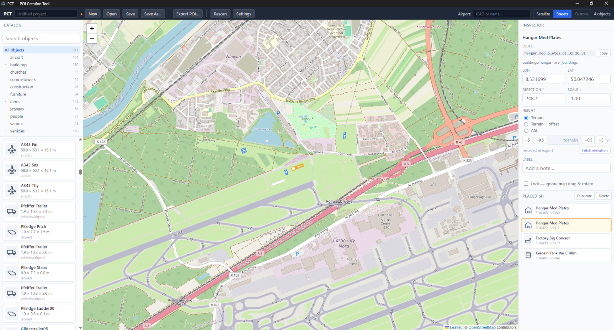

# PCT — POI Creation Tool

[](https://github.com/jlgabriel/afs4-poi-creator/actions/workflows/ci.yml)

**Decorate your Aerofly FS 4 world with the sim's own built-in objects** — hangars, towers,
terminals, vehicles, parked aircraft, street lamps and more. Place them on a real satellite
map, and PCT hands you a scenery folder you drop straight into the sim. No modelling, no file
editing.

A community tool, born on the [Aerofly forum](https://www.aerofly.com/community/) and built with
the help of the people credited [below](#how-pct-came-to-be). It's the POI-placing cousin of
[afs4-pylon-race](https://github.com/jlgabriel/afs4-pylon-race), and shares its geometry and
POI-folder conventions.



> **Status — v0.1.0, first public release.** The object scanner, the export core, and the full
> desktop editor (first-run wizard, satellite/streets map, object catalog, inspector, airport
> search, per-object height, export / install / uninstall) are built and tested — unit + golden
> tests, typecheck, and an Electron smoke test, all green in [CI](.github/workflows/ci.yml). The
> export format is **confirmed working in the sim**. Builds are currently **unsigned**, so your OS will warn
> you once on first launch — see
> [Installing PCT](#installing-pct).

## What it is

PCT lets you place **Aerofly FS 4's own built-in objects** onto a real satellite map and turn that
into a standard **POI scenery folder** that Aerofly loads like any other add-on. You never touch a
model or a config file — you click on a map, and PCT writes the folder.

**It ships no Aerofly content.** PCT reads the object catalog from *your* installed copy of the sim,
so you only ever place objects you already own. Nothing from the sim is copied into this project or
into your finished POIs — just the *names* of the objects you chose.

## How to use it

1. **Install PCT** — download the build for your system from the
   [Releases](https://github.com/jlgabriel/afs4-poi-creator/releases) page (Windows installer or
   portable · macOS `.dmg` · Linux AppImage). First launch needs one extra click — see
   [Installing PCT](#installing-pct).
2. **Point PCT at your sim** — on first run, a short wizard auto-detects where Aerofly FS 4 is
   installed and where your user folder lives, then scans your object catalog.
3. **Place objects** — search the catalog, click on the map to drop an object, then drag, rotate,
   scale and fine-tune its height. Every object's footprint is drawn at its true size, so you can
   line things up precisely.
4. **Export & install** — *Export POI → Install into Aerofly FS 4* writes the folder into your
   `scenery/poi/`. Restart Aerofly and fly to the spot. The same dialog can **uninstall** POIs that
   PCT made, so nothing is permanent.

**The POIs you create are yours.** They're the program's output and are **not** covered by PCT's
license — share them, post them, or sell them however you like.

### Installing PCT

Builds are **unsigned** for now, so the operating system warns you the first time you open one:

- **Windows** — SmartScreen shows "Windows protected your PC" → **More info → Run anyway**.
- **macOS** — Gatekeeper says the app "cannot be opened" → **right-click the app → Open → Open**
  (or System Settings → Privacy & Security → **Open Anyway**).

This is normal for a small open-source project without a paid signing certificate; the source is all
here for anyone who wants to check it or [build it themselves](#build-it-yourself).

## How PCT came to be

PCT started as a **community idea**. On the Aerofly FS 4 forum, **Michael (@ApfelFlieger)** had long
wanted a simple way to dress up the world with the sim's *own* built-in objects, without editing a single file by hand. He didn't just ask for it: he
handed over the complete file-format specification for POI scenery (the `.tsl` / `.toc` files) and
argued for a pragmatic starting scope (the static "XREF" objects that cover the large majority of
what people want to place). He also coined the family name: PCT is the
POI-only cousin of the "Racing Creation Tool" (the sibling
[afs4-pylon-race](https://github.com/jlgabriel/afs4-pylon-race)).

As it took shape, more of the community pitched in:

- **Frank Boës (@Armitage on the forum, `fboes` on GitHub)** let PCT bundle a snapshot of his open **aerofly-data** airport list, which
  powers the in-app airport search that recenters the map on any core Aerofly airport.
- **Chris (@chrispriv)** and **@Rodeo** untangled the trickiest question — how Aerofly
  decides an object's height. Chris pinned down the exact behaviour for library objects (they need an
  explicit height written in, there's no auto-height to lean on), which set PCT on the correct path;
  and @Rodeo's hands-on method for reading real terrain elevation inside the sim is how those heights
  were validated on the ground.

The code itself was built by two of Anthropic's **Claude** models working in tandem: **Fable 5**
designed the architecture and reviewed every milestone, and **Opus 4.8** wrote the implementation —
all under the direction of **Juan Luis Gabriel (@Jugac64)**, who created and steers the project.

## Thanks

- **Michael — @ApfelFlieger** — the driving idea, the file-format specification, and the scope that
  made a first release realistic.
- **Frank Boës — @Armitage (forum), `fboes` (GitHub)** — the [aerofly-data](https://github.com/fboes/aerofly-data) airport
  dataset (MIT), reused with permission.
- **Chris — @chrispriv** — the object-height mechanics for library objects ([GitHub](https://chrispriv.github.io/aeroscenery-afs_addons/)).
- **@Rodeo** — the in-sim ground-truth method for validating terrain elevation.
- **Fable 5** & **Claude Opus 4.8** (Anthropic) — architecture/reviews and implementation.

…and the wider Aerofly FS 4 forum community, who tested ideas and kept the thread alive.

## Aerofly FS 4 and IPACS

PCT only exists because of how **Aerofly FS 4** is built. IPACS made the simulator load add-on scenery
from **plain, human-readable text files**, and let that scenery place the sim's **own built-in objects
by name**. That's the whole foundation of this tool: PCT can read the object catalog straight from
*your* install and write a standard POI folder that simply *references* those objects — without ever
copying, extracting, or shipping a single piece of IPACS content. Our thanks to **IPACS** for a
simulator open enough to let its community build on it like this.

PCT is an **independent, unofficial community project** — not affiliated with or endorsed by IPACS.
Aerofly FS 4 and all its content belong to IPACS; PCT bundles none of it, and the POIs you create only
reference objects you already own.

## For developers

PCT is an **Electron + TypeScript** app (Windows / macOS / Linux) built around a deliberately
**pure core**: `src/core/` takes strings and objects in and returns strings and objects out — no
Node, no DOM, no Electron — so all the catalog and geometry logic is 100% unit-testable. The scanner
and CLI do the file I/O and *feed* the core.

**The one hard rule:** PCT ships **zero IPACS assets**. It reads the object catalog from *your*
installed copy of the sim at runtime; nothing IPACS-derived (scanned object dimensions, `.tmi` /
`.tmb` bytes) is ever committed to this repo. Only object *names* — public facts — ship, in a curated
category table. Test fixtures use invented names.

### Build it yourself

Requires **Node.js ≥ 20** (developed on 24 LTS). An Aerofly FS 4 install is only needed to *scan* a
real catalog; the unit tests are self-contained.

```bash
npm install
npm run dev              # run the desktop app (electron-vite, hot reload)
npm test                 # unit + golden tests over src/core/ (self-contained)
npm run typecheck
npm run build:win        # or build:mac (on macOS) / build:linux  → dist/
```

There's also a headless CLI: `npm run scan` reads your install's object catalog and writes a
`catalog.json`, and `npm run export` builds a POI folder from a project file — handy for scripting.
On a stock install the scan finds **911 objects** across 7 XREF bundles.

## License

**GPL-3.0-or-later** © 2026 Juan Luis Gabriel

PCT is free software: you can redistribute it and/or modify it under the terms of the GNU General
Public License as published by the Free Software Foundation, either version 3 of the License, or (at
your option) any later version. PCT is distributed in the hope that it will be useful, but **WITHOUT
ANY WARRANTY**; without even the implied warranty of merchantability or fitness for a particular
purpose. See the [`LICENSE`](LICENSE) file for the full text.

**The POI packages you create with PCT are your own.** They are the program's output and are **not**
covered by the GPL — do with them whatever you like.

PCT bundles third-party components (Leaflet, React, Zustand, Zod, Electron, and others) under their
own permissive licenses, and reuses Frank Boës's MIT airport data; their notices are preserved in
[`THIRD_PARTY_NOTICES.md`](THIRD_PARTY_NOTICES.md).
