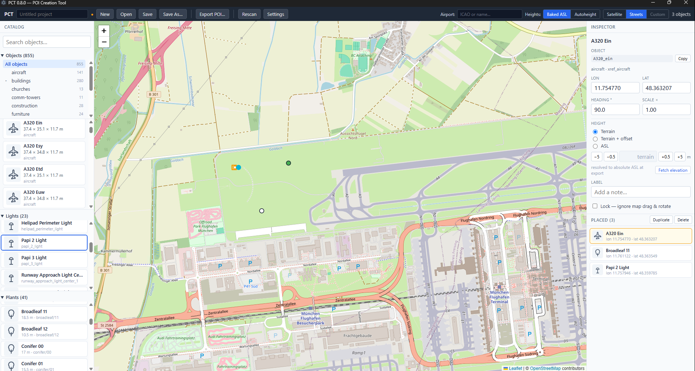

# PCT — POI Creation Tool

[](https://github.com/jlgabriel/afs4-poi-creator/actions/workflows/ci.yml)
[](https://github.com/jlgabriel/afs4-poi-creator/releases/latest)

**Decorate your Aerofly FS 4 world with the sim's own built-in objects** — hangars, towers,
terminals, vehicles, parked aircraft, street lamps and more — **and light it up at night**. Place
them on a real satellite map, and PCT hands you a scenery folder you drop straight into the sim.
No modelling, no file editing.

**New here? → [Read the guide](guide/GUIDE.md).** Thirteen sections and thirty-one pictures, from a
[five-minute quickstart](guide/GUIDE.md#3-quickstart--one-object-five-minutes) to the one part that
isn't obvious — getting what you place onto the ground. A twelve-object
[starter project](guide/example/kdag_starter.json) comes with it, ready to install and then take
apart.

A community tool, born on the [Aerofly forum](https://www.aerofly.com/community/) and built with
the help of the people credited [below](#how-pct-came-to-be). It's the POI-placing cousin of
[afs4-pylon-race](https://github.com/jlgabriel/afs4-pylon-race), and shares its geometry and
POI-folder conventions.



> **Status — released and actively developed.** The object scanner, the export core, and the full
> desktop editor (first-run wizard, satellite/streets map, object catalog, inspector, airport
> search, per-object height, export / install / uninstall) are built and tested — unit + golden
> tests, typecheck, and Electron end-to-end tests, all green in [CI](.github/workflows/ci.yml).
> Lights, plants, your own custom XREF objects, an optional "Sim autoheight" export mode, real
> object photos and hand-measured footprints are all in — each feature below is tagged with the
> version it arrived in, and the
> release notes carry the full history. The export format is **confirmed working in the sim**. Builds
> are currently **unsigned**, so your OS will warn you once on first launch — see
> [Installing PCT](#installing-pct). Grab the newest build from
> [Releases](https://github.com/jlgabriel/afs4-poi-creator/releases/latest).

## What it is

PCT lets you place **Aerofly FS 4's own built-in objects** onto a real satellite map and turn that
into a standard **POI scenery folder** that Aerofly loads like any other add-on. You never touch a
model or a config file — you click on a map, and PCT writes the folder.

**Lights, too.** Since **v0.2** you can place the sim's own **airport-light fixtures** (runway edge, PAPI,
approach, taxiway, helipad…) and fully parametric **point lights**, where you pick the colour, the
brightness and the flash pattern. Stagger the flash across a row of them and you get a running-light
sweep. Lights only show at night in the sim — that's Aerofly's behaviour, not a bug.

**Plants, too.** Since **v0.4** you can plant the sim's own **trees and shrubs** — broadleaf, conifer,
conifer forest, palm, shrub and alley, 41 of them, each with its own natural height from 0.8 m of scrub
to a 28 m forest conifer. Pick one from the **Plants** section, click the map, and set how tall it
grows. They're billboards, so there's no rotation to worry about — a tree always faces you.

**Your own objects, too.** Since **v0.3**, PCT can also place the custom **XREF objects you've added
to your sim** — the model files you (or a scenery add-on) dropped into Aerofly's `scenery/xref`
folder. PCT reads each model's name and footprint, registers it so the sim can resolve it, then
treats it like any built-in: place it, rotate it, set its height, export. See
[Placing your own XREF objects](#placing-your-own-xref-objects).

**Real photos on the cards, too.** Since **v0.6** you can swap PCT's drawn category icons for real
photos of the objects, and since **v0.7** putting one there takes two clicks: screenshot the object in
the sim, then right-click its card and choose **Paste photo**. **v0.8** extends that to the **lights**
and the **plants**, so every card in the catalog can show the real thing. The photos are **yours**, read
straight from your disk — never bundled into PCT and never written into your POIs. See
[Photos of your objects](#photos-of-your-objects).

**Sizes you measure, too.** Since **v0.9**, anything the sim doesn't describe can be given a size by
hand. Your install tells PCT how big each **object** is, but it says nothing about the **lights** or the
**plants** — so those drew on the map as bare points, and a big approach-light bar looked exactly like a
single lamp. Right-click a card, choose **Set footprint**, type width × depth × height, and it draws at
that size from then on. The measurements are **yours**: they live in your own file, survive a rescan, and
can be exported and handed to somebody else. See
[Footprints you measure yourself](#footprints-you-measure-yourself).

**It ships no Aerofly content.** PCT reads the object catalog from *your* installed copy of the sim,
so you only ever place objects you already own. Nothing from the sim is copied into this project or
into your finished POIs — just the *names* of the objects you chose.

## How to use it

The short version is below. For the whole thing walked through with pictures, see
**[the guide](guide/GUIDE.md)**.

1. **Install PCT** — download the build for your system from the
   [Releases](https://github.com/jlgabriel/afs4-poi-creator/releases) page (Windows installer or
   portable · macOS `.dmg` · Linux AppImage). First launch needs one extra click — see
   [Installing PCT](#installing-pct).
2. **Point PCT at your sim** — on first run, a short wizard auto-detects where Aerofly FS 4 is
   installed and where your user folder lives, then scans your object catalog.
3. **Place objects, lights and plants** — search the catalog, click on the map to drop an object, then
   drag, rotate, scale and fine-tune its height. Every object's footprint is drawn at its true size, so
   you can line things up precisely — and since **v0.9** you can give a **light or a plant** a size too,
   by measuring it yourself: see [Footprints you measure yourself](#footprints-you-measure-yourself).
   Below the catalog, the **Lights** section holds the airport-light fixtures and the custom point light,
   and **Plants** holds the trees and shrubs.
4. **Export & install** — *Export POI → Install into Aerofly FS 4* writes the folder into your
   `scenery/poi/`. Restart Aerofly and fly to the spot. The same dialog can **uninstall** POIs that
   PCT made, so nothing is permanent.
5. **Optional: photograph what you placed** — once you're out there looking at your objects,
   screenshot one to the clipboard and right-click its card in PCT to paste it in. From then on the
   catalog shows the real thing instead of a drawn icon. See
   [Photos of your objects](#photos-of-your-objects).

**The POIs you create are yours.** They're the program's output and are **not** covered by PCT's
license — share them, post them, or sell them however you like.

### Placing your own XREF objects

Beyond the sim's built-in catalog, PCT can place the **custom objects you've added to Aerofly
yourself** — model files (`.tmb`) that you, or a scenery add-on, put in your Aerofly FS 4
`scenery/xref/` folder.

A loose `.tmb` won't render in the sim on its own: Aerofly needs a small scene-index (`.tmi`)
generated for it, in its **own subfolder**. PCT does that for you:

1. **Drop your model** into `…/Aerofly FS 4/scenery/xref/` — the `.tmb`, plus its `.ttx` textures if
   it has any.
2. **Rescan** in PCT (re-run the wizard, or use *Rescan* in the catalog). Your objects show up with an
   **"unregistered"** badge, and a banner offers to register them.
3. **Click Register.** PCT reads each model's name and size, generates its `.tmi`, and moves it into
   its own subfolder next to its textures. Your objects become normal, **placeable** catalog entries.
4. **Place, rotate, set the height and export** — exactly like a built-in object.

**What's supported:** text-format `.tmb` — the kind Aerofly's SDK and the AC3D exporter produce — are
read fully (name, footprint, textures). IPACS's **pre-compiled binary** `.tmb` can't be read
automatically and appear greyed out. As everywhere else, PCT ships and copies **no model bytes**: it
only re-lays *your* files and writes the small `.tmi` index next to them.

### Photos of your objects

A catalog card normally shows a drawn icon sized to the object's real footprint. If you'd rather see
the object itself, PCT can show **your own photos** instead — on the catalog cards and in the placed
list. It never ships or downloads any: the pictures are ones you took, on your own disk.

Since **v0.8** this covers **every** card: the objects, the **lights** and the **plants**. Those two
sections are where a drawn icon says least — a runway edge light and a taxiway edge light get the same
glyph, and Broadleaf 00 and 01 are the same tree a metre apart in height.

First, pick where they live: *Settings → Object photos folder*. Then, for each object:

1. **Photograph it in the sim.** Get a good view of something you've placed, frame it, and take a
   screenshot **to the clipboard** — `Win+Shift+S` on Windows, `Cmd+Ctrl+Shift+4` on macOS.
2. **Right-click that object's card in PCT** and choose **Paste photo from clipboard**. PCT saves the
   image into your folder named after that exact object, and the card updates immediately — no
   filename to type and no ids to match by hand. The same menu also has **Remove photo** and **Open
   photos folder**.

You can also fill the folder yourself: name a file after the card's id, in jpg, jpeg, png or webp, and
it will be picked up. Objects use their bare id; lights and plants are prefixed, because they share the
one folder with the ~900 objects:

| Card | File name |
| --- | --- |
| an object (built-in or your own XREF) | `a380_klm.jpg`, `cabin-boat-red.png` |
| an airport light | `light.runway_edge_light.jpg` |
| the custom point light | `light.point.jpg` |
| a plant | `plant.palm.08.jpg`, `plant.conifer_forest.01.jpg` |

Anything without a photo simply keeps its drawn icon.

You never have to work this out by hand — **rest the mouse on a card** for a moment and a preview pops
up with the photo enlarged and the file name spelled out, and **Paste photo** writes it for you. Photos
you took with v0.6 or v0.7 keep working untouched: an object's file name has not changed.

### Footprints you measure yourself

*(v0.9)* On the map, an object is drawn as a **rectangle at its true size** — that's how you line things
up against the imagery. A **light** or a **plant** isn't, because nothing in your install says how big
one is: objects are indexed with their dimensions, lights and plants are not indexed at all. So they draw
as a **point**, and nine different approach-light bars all look identical.

If you know the size, you can just say so. **Right-click the card → Set footprint**, type the three
numbers in metres, Save. From then on that light or plant draws as a real rectangle you can align, and
the card shows its size.

- **Width (X) runs along the facing arrow** the map draws, depth (Y) across it. If the box comes out
  turned 90°, swap the two numbers — for a light, PCT has no way to know which way its model was built,
  so it assumes the common one and lets you correct it.
- **Height is stored but doesn't change the map.** A footprint is a ground outline.
- It works on **objects** as well, if your install's own figure is wrong or missing.
- **Nothing here is exported.** The Aerofly POI format has no footprint field — this only changes what
  PCT draws while you're placing things.

The measurements are yours, kept in your own `footprints.json` next to your settings. **Rescanning your
install never clears them.** *Settings → Object footprints* has **Export** and **Import**, so one person
can measure a family of fixtures once and post the file for everyone else — importing merges it into
yours and tells you how many entries it added and how many of yours it replaced.

### Good to know

A couple of things worth knowing about the editor:

- **"Heading °"** on an XREF object is a real **compass heading** — `0` = north, `90` = east,
  clockwise — not a raw rotation. PCT applies the object-facing convention it **calibrated in the
  sim**, so the value matches what you'd fly, and the map's **cyan handle** points the way the object
  faces. It's a best-effort convention that holds for the large majority of objects; if one comes out
  turned the wrong way, line its **footprint rectangle** up with the imagery — that reads true no
  matter which way the model was authored. (An **airport light** still shows a raw **"Orientation °"**,
  since lights weren't part of the heading calibration. Either can be dragged with the **cyan handle**
  on the map — hold **Shift** to snap to 5°.)
- **Height modes** — how an object's height reaches the sim, chosen **per project** from the top bar (and
  echoed in the Export dialog):
  - **Baked ASL** (default) — PCT writes each object an **absolute** elevation (metres ASL). *Terrain*
    looks up the ground height and bakes it in; *Terrain + offset* adds metres on top (rooftop items);
    *ASL* is a value you type. So "Terrain" does **not** mean `0` — it means the resolved ground elevation.
  - **Sim autoheight (beta)** — lets **Aerofly itself** set the ground under each object at load time, so
    *Terrain* means "on the ground" and *Terrain + offset* floats N metres above it. The export is then
    **fully offline** (no elevation lookup) and objects follow the terrain even if the sim re-levels it —
    so heights come out more reliable than a baked value, at the cost of leaning on undocumented sim
    behaviour (hence *opt-in*, and it may change with a sim update). *ASL* has no meaning in this mode.
    Suggested and worked out on the forum by **@chrispriv**, with **@ApfelFlieger**.
- **If something goes wrong**, PCT keeps a plain-text log of the session — the folders it used, what
  the scan found, and anything that failed. **Settings → Diagnostics → Open log file**. It's
  **rewritten from scratch every time PCT starts**, so it never grows and there's nothing to clean up,
  and nothing in it is sent anywhere. Pasting it into a bug report saves a round of questions.

### Installing PCT

Builds are **unsigned** for now, so the operating system warns you the first time you open one:

- **Windows** — SmartScreen shows "Windows protected your PC" → **More info → Run anyway**.
- **macOS ("cannot be opened")** — right-click the app → **Open → Open**, or System Settings →
  Privacy & Security → **Open Anyway**. (This is the warning you'll usually get on the Intel build.)

On **Apple Silicon** you may instead see **"PCT.app is damaged and can't be opened."** It isn't
damaged — it's the same unsigned-app quarantine — but on Apple chips it can't be cleared from the
menus. Drag **PCT.app** into your **Applications** folder, then run this once in **Terminal** and open
it normally:

```
xattr -cr /Applications/PCT.app
```

Prefer the **`arm64`** download on Apple Silicon; the Intel build also works but runs under Rosetta,
which Apple is retiring.

This is normal for a small open-source project without a paid signing certificate; the source is all
here for anyone who wants to check it or [build it themselves](#build-it-yourself).

## How PCT came to be

PCT started as a **community idea**. On the Aerofly FS 4 forum, **Michael (@ApfelFlieger)** had long
wanted a simple way to dress up the world with the sim's *own* built-in objects, without editing a single file by hand. He didn't just ask for it: he
handed over the complete file-format specification for POI scenery (the `.tsl` / `.toc` files) and
argued for a pragmatic starting scope (the static "XREF" objects that cover the large majority of
what people want to place). He also coined the family name: PCT is the
POI-only cousin of the "Racing Creation Tool" (the sibling
[afs4-pylon-race](https://github.com/jlgabriel/afs4-pylon-race)).

As it took shape, more of the community pitched in:

- **Frank Boës (@Armitage on the forum, `fboes` on GitHub)** let PCT bundle a snapshot of his open **aerofly-data** airport list, which
  powers the in-app airport search that recenters the map on any core Aerofly airport.
- **Christophe (@chrispriv)** and **Rodeo** untangled the trickiest question — how Aerofly
  decides an object's height. Christophe pinned down the exact behaviour for library objects (they need an
  explicit height written in, there's no auto-height to lean on), which set PCT on the correct path;
  and Rodeo's hands-on method for reading real terrain elevation inside the sim is how those heights
  were validated on the ground. Christophe went on to design the **Sim-autoheight** mode added in v0.5 —
  the project-level approach and the exact `.tsl` / `.toc` behaviour behind it — with **@ApfelFlieger**.

The code itself was built by Anthropic's **Claude** models working in tandem: **Fable 5** designed the
architecture and reviewed every milestone, and **Claude Opus** wrote the implementation — all under
the direction of **Juan Luis Gabriel (@Jugac64)**, who created and steers the project.

## Thanks

- **Michael — @ApfelFlieger** — the driving idea, the file-format specification, and the scope that
  made a first release realistic.
- **Frank Boës — @Armitage (forum), `fboes` (GitHub)** — the [aerofly-data](https://github.com/fboes/aerofly-data) airport
  dataset (MIT), reused with permission.
- **Christophe — @chrispriv** — the object-height mechanics for library objects, and the design of the
  **Sim-autoheight** mode (v0.5) ([GitHub](https://chrispriv.github.io/aeroscenery-afs_addons/)).
- **Rodeo (forum)** — the in-sim ground-truth method for validating terrain elevation.
- **Fable 5** & **Claude Opus** (Anthropic) — architecture/reviews and implementation.

…and the wider Aerofly FS 4 forum community, who tested ideas and kept the thread alive.

## Aerofly FS 4 and IPACS

PCT only exists because of how **Aerofly FS 4** is built. IPACS made the simulator load add-on scenery
from **plain, human-readable text files**, and let that scenery place the sim's **own built-in objects
by name**. That's the whole foundation of this tool: PCT can read the object catalog straight from
*your* install and write a standard POI folder that simply *references* those objects — without ever
copying, extracting, or shipping a single piece of IPACS content. Our thanks to **IPACS** for a
simulator open enough to let its community build on it like this.

PCT is an **independent, unofficial community project** — not affiliated with or endorsed by IPACS.
Aerofly FS 4 and all its content belong to IPACS; PCT bundles none of it, and the POIs you create only
reference objects you already own.

## The guide

This README says what PCT is and how to install it. The guide takes you through using it, illustrated
from a real session at Barstow-Daggett:

**→ [guide/GUIDE.md](guide/GUIDE.md)**

Thirteen sections and thirty-one pictures: a five-minute quickstart that puts one unmissable object
beside a runway, the editor panel by panel, placing and rotating, straightening and spacing a whole
row at once, **heights** — the part that repays reading, worked through as the three passes it
actually takes rather than the one you would hope for — lights and plants, exporting and installing,
a cookbook of six scenes worth building, photos and footprints of your own, your own models, and
what to look at when something doesn't show up in the sim.

A twelve-object starter project comes with it, ready to install and then take apart:
[guide/example/kdag_starter.json](guide/example/kdag_starter.json).

## The Aerofly FS 4 technical reference

Building PCT meant working out how Aerofly FS 4 actually stores and places scenery — much of which
IPACS never documented. That knowledge is written up as a standalone field guide to **the simulator
and its on-disk format**, not to this tool:

**→ [reference/AFS4_KNOWLEDGE_BASE_EN.md](reference/AFS4_KNOWLEDGE_BASE_EN.md)**

Fifteen sections: where everything lives in an install, the `<[type][name][value]>` file grammar,
what `tm.log` tells you before you ever take off, POI vs airport placement, the built-in XREF
catalog, orientation and heading maths, heights and autoheight, plants, lights, your own `.tmb`
objects, built-in POIs and landmarks, heliports and the `.wad` projection, the UDP flight-data
stream, the Blender-to-`.tmb` pipeline, and the public datasets worth knowing about.

It's there for anyone building things for AFS4, whether or not they ever touch PCT. Verify anything
critical against your own install: the sim is undocumented in these areas and changes between
versions.

## For developers

PCT is an **Electron + TypeScript** app (Windows / macOS / Linux) built around a deliberately
**pure core**: `src/core/` takes strings and objects in and returns strings and objects out — no
Node, no DOM, no Electron — so all the catalog and geometry logic is 100% unit-testable. The scanner
and CLI do the file I/O and *feed* the core.

**The one hard rule:** PCT ships **zero IPACS assets**. It reads the object catalog from *your*
installed copy of the sim at runtime; nothing IPACS-derived (scanned object dimensions, `.tmi` /
`.tmb` bytes) is ever committed to this repo. Only object *names* — public facts — ship, in a curated
category table. Test fixtures use invented names.

The one binary PCT does ship is **its own**: `assets/pct_anchor.tmb` + `.ttx`, a tiny anchor mesh a POI
needs when it holds plants (without it the sim culls them at altitude — v0.4). Its mesh and texture are
ours, made for PCT and compiled with IPACS's official content converter; it carries zero IPACS bytes.
See the [License](#license) note.

### Build it yourself

Requires **Node.js ≥ 20** (developed on 24 LTS). An Aerofly FS 4 install is only needed to *scan* a
real catalog; the unit tests are self-contained.

```bash
npm install
npm run dev              # run the desktop app (electron-vite, hot reload)
npm test                 # unit + golden tests over src/core/ (self-contained)
npm run typecheck
npm run build:win        # or build:mac (on macOS) / build:linux  → dist/
```

There's also a headless CLI: `npm run scan` reads your install's object catalog and writes a
`catalog.json`, and `npm run export` builds a POI folder from a project file — handy for scripting.
On a stock install the scan finds **911 objects** across 7 XREF bundles.

## License

**GPL-3.0-or-later** © 2026 Juan Luis Gabriel

PCT is free software: you can redistribute it and/or modify it under the terms of the GNU General
Public License as published by the Free Software Foundation, either version 3 of the License, or (at
your option) any later version. PCT is distributed in the hope that it will be useful, but **WITHOUT
ANY WARRANTY**; without even the implied warranty of merchantability or fitness for a particular
purpose. See the [`LICENSE`](LICENSE) file for the full text.

**The POI packages you create with PCT are your own.** They are the program's output and are **not**
covered by the GPL — do with them whatever you like.

PCT bundles third-party components (Leaflet, React, Zustand, Zod, Electron, and others) under their
own permissive licenses, and reuses Frank Boës's MIT airport data; their notices are preserved in
[`THIRD_PARTY_NOTICES.md`](THIRD_PARTY_NOTICES.md).

**Bundled anchor mesh.** PCT ships one binary asset, `assets/pct_anchor.tmb` + `.ttx`, used to anchor a
POI's plants so Aerofly doesn't cull them at altitude (v0.4). Its geometry and texture are **our own
work** — © 2026 Juan Luis Gabriel, **GPL-3.0-or-later**, same as PCT — compiled into Aerofly's binary
format with IPACS's official **Aerofly FS 4 Content Converter**. That converter is IPACS's software and
is **not** redistributed here; only its output, built entirely from our own source mesh and texture,
ships in this repo (confirmed OK with IPACS via ApfelFlieger). See
[`THIRD_PARTY_NOTICES.md`](THIRD_PARTY_NOTICES.md).
