# PCT — the guide

**Decorate your Aerofly FS 4 world with the sim's own built-in objects.** Place them on a real
satellite map, and PCT hands you a scenery folder you drop straight into the sim. No modelling, no
file editing.

This guide is written to be read straight through the first time, and dipped into afterwards. Each
section stands on its own.

| § | Section | What's in it |
|---|---|---|
| 1 | [What PCT actually does](#1-what-pct-actually-does) | The idea in two pictures, and three things to know up front. |
| 2 | [Getting PCT running](#2-getting-pct-running) | Download, the one-time warning from your OS, the first-run wizard. |
| 3 | [Quickstart](#3-quickstart--one-object-five-minutes) | The shortest route to "it worked": one object, five minutes. |
| 4 | [The editor in one screen](#4-the-editor-in-one-screen) | Four panels, and what each one is for. |
| 5 | [Placing, moving, rotating](#5-placing-moving-rotating) | Placement, the rotate handle, whole selections, tidy rows, shortcuts. |
| 6 | [Heights](#6-heights--the-one-thing-that-isnt-obvious) | The one genuinely fiddly part, with a worked example flown at KDAG. |
| 7 | [Lights and plants](#7-lights-and-plants) | Why a light shows nothing at noon, and the two fields both called "height". |
| 8 | [Exporting and installing](#8-exporting-and-installing) | The Export dialog field by field. Uninstalling, and sharing what you made. |
| 9 | [Heliports](#9-heliports--somewhere-to-fly-from) | Turning the same project into a place Aerofly will let you start a flight from. |
| 10 | [Cookbook](#10-cookbook--seven-things-worth-building) | Seven scenes worth building, and a starter project to take apart. |
| 11 | [Making the catalog yours](#11-making-the-catalog-yours--photos-and-footprints) | Your own photos on the cards, and sizes for the objects the sim doesn't measure. |
| 12 | [Your own models](#12-your-own-models) | Placing custom XREF objects you've added to the sim. |
| 13 | [When something goes wrong](#13-when-something-goes-wrong) | Symptom by symptom — and where the log file is. |
| 14 | [Where to go next](#14-where-to-go-next) | The forum, the technical reference, the source, and who built what. |

**In a hurry?** Section 3 puts one object into the sim in five minutes. If it doesn't turn up, the
answer is almost always the first line of section 13.

---

## 1. What PCT actually does

Aerofly FS 4 already contains hundreds of scenery objects — hangars, control towers, terminals,
fuel tanks, vehicles, parked aircraft, street lamps, trees. They sit in your install, and normally
only IPACS's own scenery uses them.

PCT lets you place those same objects yourself. You click on a satellite map, PCT writes a standard
POI scenery folder, you drop it into Aerofly, and the objects are there next time you fly.

Placed in PCT, on a satellite map. And then the same spot, flown:

That is the whole idea: what you arrange on the map is what you fly through in the sim.

PCT can write that same scene out a second way, as a **heliport** — a small airport of your own that
Aerofly lists among the places you can start a flight from, with a pad you sit on and everything you
placed around you. That's [section 9](#9-heliports--somewhere-to-fly-from), and the rest of the guide
applies to it unchanged: it is the same map, the same objects and the same heights.

Three things are worth knowing up front:

- **PCT ships no Aerofly content.** It reads the object catalog out of *your* installed copy of the
  sim. You only ever place objects you already own, and the folder PCT writes contains only the
  *names* of the objects you chose — never the objects themselves.
- **The POIs you make are yours.** They're the program's output, not covered by PCT's license.
  Share them, post them, sell them.
- **Nothing is permanent.** PCT installs POI and heliport folders, and can uninstall the ones it made.

A stock install gives PCT about **911 objects**, **41 plants** and **22 airport light fixtures** to
work with, plus a parametric point light of PCT's own.

---

## 2. Getting PCT running

**Download.** Grab the build for your system from the releases page:
https://github.com/jlgabriel/afs4-poi-creator/releases/latest

Windows installer or portable · macOS `.dmg` (arm64 and Intel) · Linux AppImage.

**First launch needs one extra click.** The builds are unsigned — this is a small open-source
project without a paid signing certificate — so your OS warns you once:

- Windows: SmartScreen says "Windows protected your PC" → More info → Run anyway.
- macOS: right-click the app → Open → Open. Or System Settings → Privacy & Security → Open Anyway.
- macOS on Apple Silicon may instead say "PCT.app is damaged and can't be opened". It isn't — it's
  the same quarantine flag, which on Apple chips can't be cleared from the menus. Drag PCT.app into
  Applications, then run this once in Terminal and open it normally:

      xattr -cr /Applications/PCT.app

**Then point PCT at your sim.** A short wizard runs on first launch. Three screens, and that is the
whole setup.

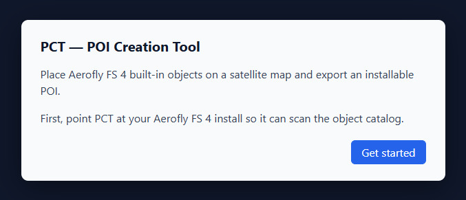

It auto-detects where Aerofly FS 4 is installed and asks you to confirm. If it guessed wrong — a
non-standard Steam library, a moved install — use **Browse…** and pick the folder that *contains*
the sim's `scenery` directory. Then press **Scan**.

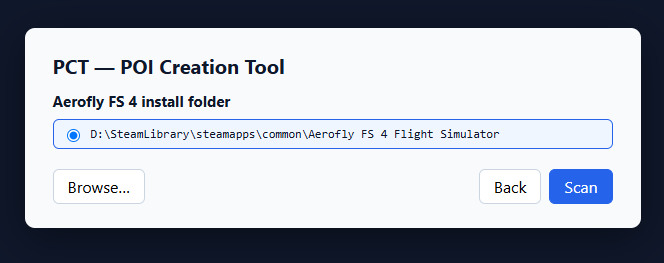

The scan takes a few seconds and reports what it found, bundle by bundle. Press **Open editor** and
you're in.

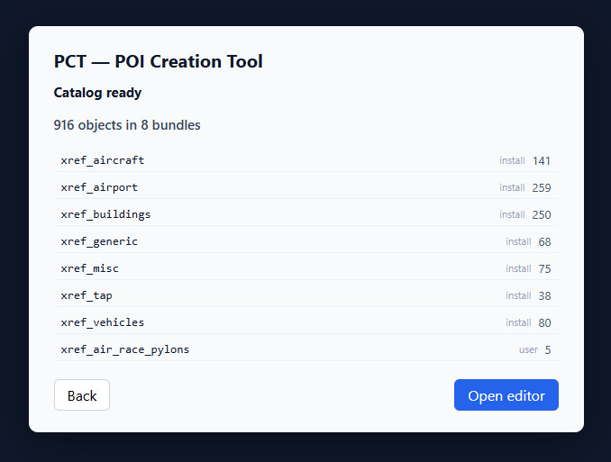

Bundles you added yourself are listed here too, tagged `user` instead of `install` — that's the
`xref_air_race_pylons` line above, and section 12 covers how to register your own.

You can change the install folder later in **Settings**, and you can re-run this same scan at any
time with **Rescan** — which is how PCT picks up anything you add to the sim afterwards. Settings is
also where the photo and footprint folders live (section 11) and where the log file is (section 13).

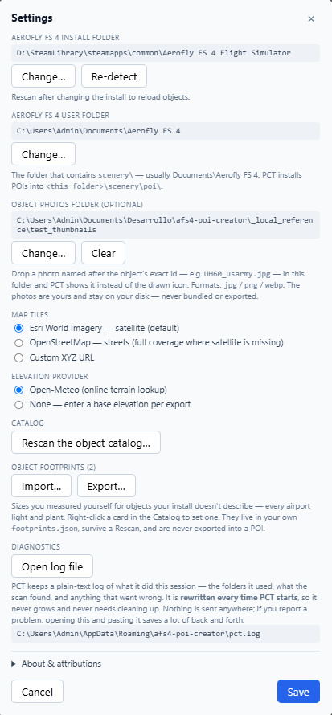

---

## 3. Quickstart — one object, five minutes

The fastest possible route to "it worked". One object, somewhere you can't miss it.

We'll use **Barstow-Daggett (KDAG)** — a quiet airfield in the California desert. Flat, empty,
and nothing around to hide what you place.

1. **Find the airport.** Type `KDAG` into the airport search in the top bar. The map recenters on
   the field. Zoom in until you can see the runway clearly.
2. **Pick an object you cannot possibly miss.** In the Catalog panel, open **Objects** and search
   for `tower00_large`. It's 24 × 27 metres on the ground and **80 metres tall** — a skyscraper,
   in a desert. Click its card once; the card highlights to show placement is armed.
3. **Click the map**, on open ground beside the runway — not on it. The object appears as a
   rectangle drawn at its true size, with a cyan handle showing which way it faces.
4. **Leave the height alone.** The default is *Terrain*, which means "on the ground here". That's
   what you want.
5. **Export it.** Click **Export POI…**. Type a POI name — `kdag_first_tower` — leave *Anchor* on
   *Auto*, leave *Destination* on **Install into Aerofly FS 4**, and click **Install into AFS4**.
6. **Restart Aerofly FS 4** and fly to KDAG.

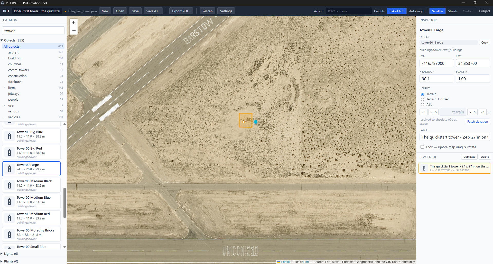

**A restart is required.** Aerofly reads `scenery/poi/` at startup; it will not pick up a new POI
mid-session. This catches everybody once.

If you don't see it, jump to section 13 — but the overwhelmingly common cause is simply not having
restarted the sim.

To take it out again: **Export POI…** → the **Installed POIs** list at the bottom → **Uninstall**.

That loop — place, export, restart, look — is the whole of PCT. Everything after this section refines
it: [section 6](#6-heights--the-one-thing-that-isnt-obvious) for getting things properly onto the
ground, and [section 10](#10-cookbook--seven-things-worth-building) for ideas about what to build.

---

## 4. The editor in one screen

Four areas, and that's the whole app.

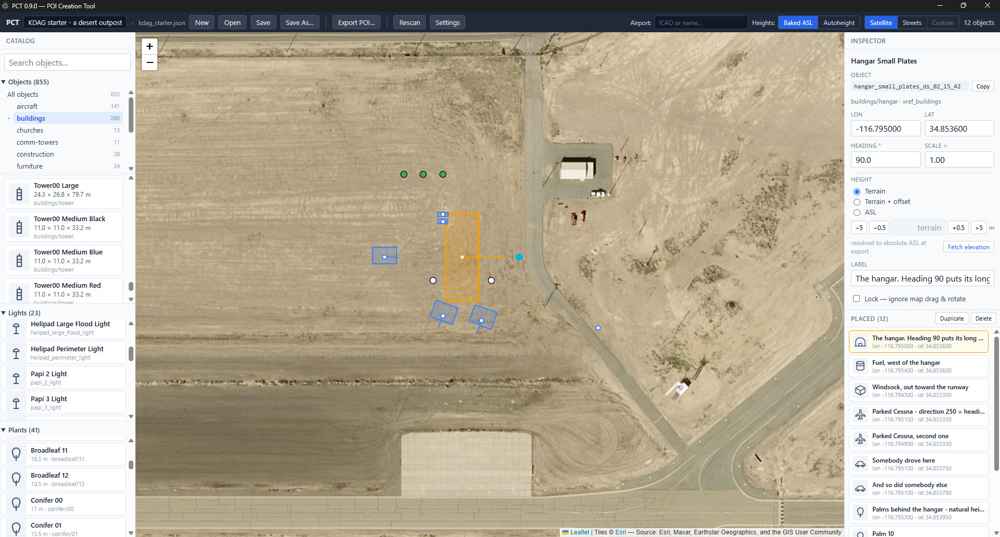

**The top bar** holds the project (name, New / Open / Save / Save As…), **Export POI…**,
**Install HELIPORT…**, **Rescan**, **Settings**, **Help ↗**, the airport search, the **Heights** mode
switch, the map style switch (Satellite / Streets / Custom), and a running count of what you've
placed.

**The Catalog panel**, on the left, is everything you can place, in four collapsible sections:

- **Objects** — the built-in XREF models, with a category tree (buildings, aircraft, vehicles, items,
  jetways, construction, furniture, people, churches, comm-towers…) and a search box.
- **Lights** — the sim's 22 airport light fixtures plus a fully parametric point light.
- **Plants** — 41 trees and shrubs.
- **Airport** — one card, **Start - Helicopter**: the pad a heliport is built around
  ([section 9](#9-heliports--somewhere-to-fly-from)).

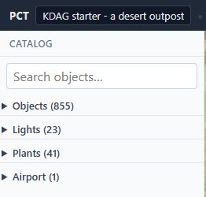

All four start collapsed, so you can see the families and their counts at a glance; open the
ones you're working with. Each card shows the object's name, its real footprint in metres, and its
category. **Rest the mouse on a card** for a second and a preview pops up with the object's exact id
spelled out.

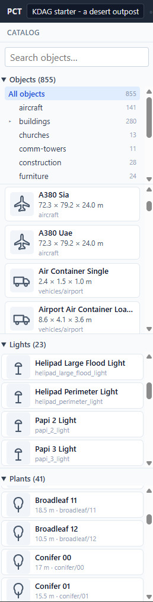

The Objects count reads about **850**, not the 911 the scan reported. The difference is the flexible
jetways: some 60 of those parts are bends and passenger bridges that only line up when an airport's own
scenery assembles them, and on their own they're noise in a browser. PCT hides those and keeps the 20
free-standing footway pieces you can place yourself. Nothing is lost — a hidden object stays in the
catalog, so an old project that used one still opens, exports and flies.

**The map**, in the middle. Satellite imagery from Esri by default; switch to streets when the
imagery is poor in your area, or plug in your own tile URL in Settings. Every placed object is
drawn as a rectangle **at its true size** — that's what lets you line things up against real
features.

**The Inspector**, on the right, edits whatever is selected: exact coordinates, heading, scale,
height, a free-text label, and a lock. Select more than one object and it turns into the arrange
panel instead — section 5; select the helipad and it shows the whole heliport — section 9. Collapsed
at the bottom, **FS4 internal (.wad)** reads the same position back in the projected units the sim
uses inside its own airport database; it changes nothing and is there for the few people who
hand-build heliport files (section 14 says where that's documented).

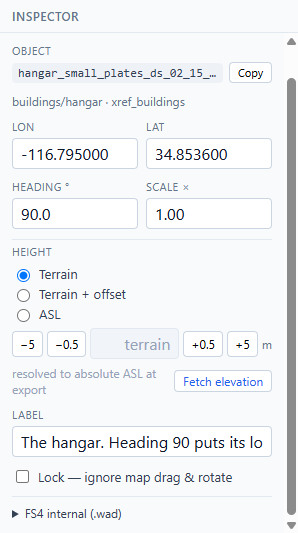

Below the Inspector, **the placed list** is everything in the project. Click a row to select it,
shift-click to add to the selection, **double-click to send the map to it** — handy once a project has
grown past what fits on screen — and **Duplicate** / **Delete** at the top of the list act on whatever
is selected. If the project has a helipad, it gets a row of its own pinned above the objects, and
stays out of their count.

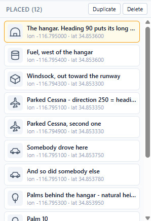

---

## 5. Placing, moving, rotating

**To place:** click a catalog card to arm it, then click the map. The card stays armed, so you can
drop a row of the same object with repeated clicks. Click the armed card again — or press **Esc** —
to disarm.

**To move:** drag the object on the map. Or select it and use the **arrow keys**: 0.5 m per press,
**Shift** for 5 m. Or type exact coordinates into the Inspector.

**To rotate:** drag the **cyan handle**, holding **Shift** to snap to 5°. Or press **R** to jump
straight to the rotation field and type a number.

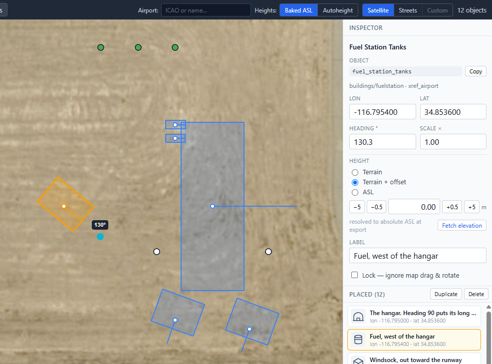

**"Heading °" is a real compass heading** — 0 = north, 90 = east, clockwise. PCT applies the
object-facing convention it calibrated inside the sim, so the number means what you'd expect from
flying. It holds for the large majority of objects; if one comes out turned the wrong way, ignore
the number and line its **footprint rectangle** up with the imagery instead — that reads true no
matter how the model was authored.

**Scale ×** resizes the object uniformly. Useful, but a scaled object often looks scaled — treat it
as a nudge, not a modelling tool.

**Lock** in the Inspector ("ignore map drag & rotate") protects an object you've finished
positioning from a stray click. Set it once a piece is exactly where you want it.

**Label** is a note to yourself. It never reaches the sim.

### Several objects at once

**Shift-click** adds an object to the selection — on the map, or in the placed list. The Inspector
header changes to "N objects selected", and the editing gestures start working on the whole set:

- **Arrow keys** move all of them together, 0.5 m per press and 5 m with **Shift**. Dragging on the
  map is the one gesture that stays single: it moves the object you grabbed and leaves the rest.
- **Ctrl+D** duplicates everything selected — 5 m east — and leaves *the copies* selected, so a
  second **Ctrl+D** gives you a third set rather than a second one.
- **Delete** removes them all.

Each gesture is a single undo step, however many objects it moved. Holding an arrow key down counts
as one gesture too, so **Ctrl+Z** takes back the whole slide rather than the last half-metre of it.

### Tidy rows — Line up, Space evenly

Rows are what people build most: parked aircraft along an apron, lamps down a taxiway, trees along a
track. Placed by hand they come out nearly-but-not-quite straight, and nearly-but-not-quite evenly
spaced.

Select three or more objects and the Inspector offers two buttons for exactly that. Both read the row
you already made — the line through the **two objects farthest apart** — and the line beneath them
reports what PCT found, e.g. `Row: 143.6 m at 128.4°`:

- **Line up** slides every object sideways onto that line. The two at the ends are already on it, so
  they don't move.
- **Space evenly** gives every gap along the line the same length, and leaves each object's distance
  *off* the line alone.

They're independent: run either one, or both, in any order. There's no "align left" here on purpose —
left is *west*, and the row you actually want is hardly ever north-south or east-west. Both tools work
along the row itself, whatever angle it runs at.

Underneath, when everything selected is the same kind of thing, one **Heading °** field writes a
single heading to all of them; blank means they currently disagree. **Match row** turns the whole
selection to face along the row, which is the fast way to park a line of aircraft nose-to-tail — add
180 to the number if they end up facing the wrong end of it.

Two objects are a line already, so both buttons wait for a third. Objects that are **locked** still
count when PCT works out where the row runs, but they stay put — so a piece you'd already finished
positioning doesn't get pulled into line with the rest.

What the panel covers is positions and headings. **Heights are still edited one object at a time** —
that's [section 6](#6-heights--the-one-thing-that-isnt-obvious).

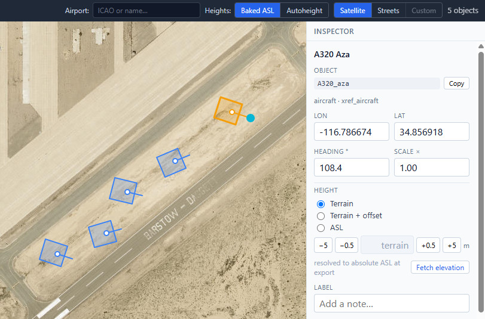

The same five, selected together, after **Line up** and **Space evenly** — and with one heading
written across the whole selection:

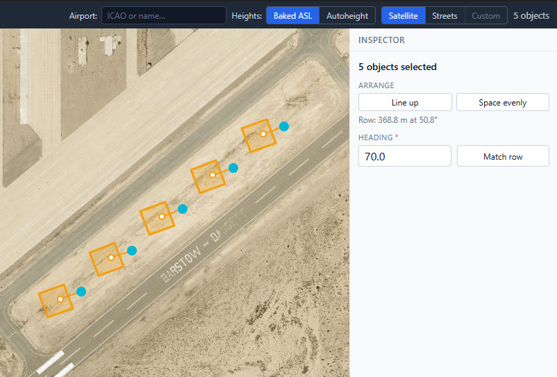

### The keyboard

| Gesture | What it does |
|---|---|
| Click a card, then the map | Place. The card stays armed for the next click. |
| **Esc** | Disarm placement. |
| Drag an object | Move it. |
| **Arrow keys** · **Shift** + arrows | Move the selection 0.5 m · 5 m. |
| Drag the cyan handle · with **Shift** | Rotate freely · snap to 5°. |
| **R** | Jump to the rotation field and select it. |
| **Shift**-click | Add to the selection. |
| **Ctrl+D** | Duplicate the selection, 5 m east. |
| **Delete** or **Backspace** | Remove the selection. |
| **Ctrl+Z** · **Ctrl+Shift+Z** or **Ctrl+Y** | Undo · redo. |
| **Ctrl+S** · **Ctrl+Shift+S** | Save · Save As. Works even while you're typing in a field. |
| **Ctrl+N** · **Ctrl+O** | New project · Open. |

On macOS, **Cmd** does the job of Ctrl throughout.

---

## 6. Heights — the one thing that isn't obvious

Everything else in PCT is a click on a map. Height is the part that repays two minutes of reading,
and the worked example at the end of this section is the whole of it in practice.

Aerofly places library objects at an **absolute elevation** — metres above sea level. There is no
"just put it on the ground" in the file format. So PCT has to work out what the ground is.

**Per object**, the Inspector offers three modes:

- **Terrain** — sit on the ground here. *This does not mean 0.* It means "resolve the ground
  elevation under this point".
- **Terrain + offset** — ground plus N metres. For anything on a rooftop, or deliberately floating.
- **ASL** — an absolute number you type.

The ± buttons nudge by 0.5 m and 5 m. Nudging a *Terrain* object quietly promotes it to
*Terrain + offset*, so "lift it half a metre" is one click. **Fetch elevation** looks up the ground
under the selected object and shows it as `terrain ≈ 588.0 m ASL`.

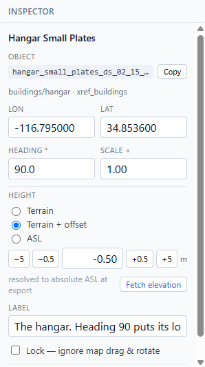

**Per project**, the top bar picks how those modes reach the sim:

- **Baked ASL** (the default) — PCT resolves each object's ground elevation and writes an absolute
  number into the POI. It looks the elevation up online, once, at export.
- **Sim autoheight (beta)** — shortened to **Autoheight** on the top bar. Aerofly itself grounds each
  object when it loads the scenery. The export is then **fully offline**, and objects follow the
  terrain even if a sim update re-levels it. In this mode *Terrain* means "on the ground",
  *Terrain + offset* floats N metres above it, and *ASL* has no meaning at all.

Autoheight is generally the more reliable of the two, because the sim's own terrain is the final
authority — the elevation service and the sim's mesh disagree by a few metres in places (at KDAG:
584 m from the service, 588 m in the sim). It's marked beta because it leans on undocumented sim
behaviour that could change with a sim update.

**Two limits of autoheight**, both enforced before export so you find out here rather than in the
air:

- **It can't place lights.** The sim buries them below the terrain. Lights need Baked ASL.
- **It can't use ASL heights**, since there's no absolute reference to hang them on.

**No internet at export time?** Use Baked ASL and type a figure into **Base elevation (m ASL)** in
the Export dialog. Every object that needs a ground height uses that one number — fine for a flat
site, wrong for a hillside. (KDAG is 588 m.)

### A worked example: getting a site onto the ground

Height is where a POI stops being a map exercise. It normally takes three passes, and the third one
takes several — which isn't a sign of doing it wrong, it's the job. Re-exporting over an installed
POI is one click and a few seconds, so this is a loop worth running rather than something to get
right first time.

Here is `guide/example/kdag_starter.json`, a twelve-object outpost at KDAG, pass by pass.

**Pass one — export with the defaults.** Leave **Base elevation** empty and PCT asks an online
elevation service what the ground is. At KDAG it answered 585 m.

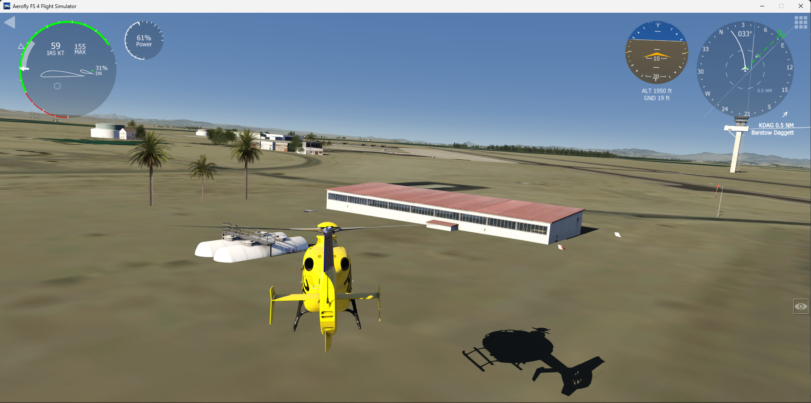

The whole site is underground. Read *how* it fails, because that is the diagnostic: the cars and the
parked Cessnas have vanished outright, the fuel tanks show only their tops and their walkway, and the
hangar merely looks oddly squat. One error, applied equally to all twelve objects — but a metre costs
a 1.5-metre car far more than a 7-metre hangar. **When the small objects disappear while the tall
ones only look low, suspect the site figure, not the objects.**

**Pass two — give the whole site the sim's own figure.** The sim's terrain is the only authority on
the sim's terrain, so go and read it off the instruments: altitude minus height-above-ground. Type
that into **Base elevation** and export again.

Expect to need more than one try at it. Read from the air the figure is a metre or two out, because
you are over *near* the objects rather than on them, and the ground here slopes away toward the
runway: 588 m overshot and left everything hovering, 587 m landed it. The reading with no parallax
in it is **to set down beside the objects and take the altitude with height-above-ground at zero**.

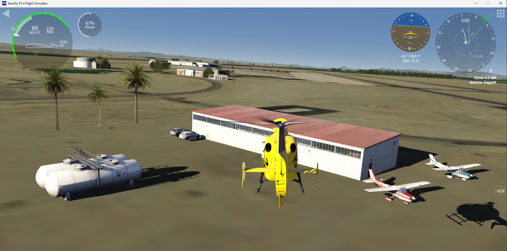

That is the site correct: the hangar sits, and the cars and the aircraft are back. Look at the
shadows, though — the tanks, the cars and the palms are all hovering slightly off the ground. One
figure can describe a site, but not its slope.

**Pass three — the last half-metre, object by object.** Select each object that's out and press
**−0.5** or **+0.5** in the Inspector. *Terrain* becomes *Terrain + offset*, which is exactly what
it's for, and negative values are perfectly normal. Export, restart, look, repeat. There is no shame
in a pass 3.1, 3.2 and 3.3 — each round is a couple of minutes, and each one is smaller than the
last.

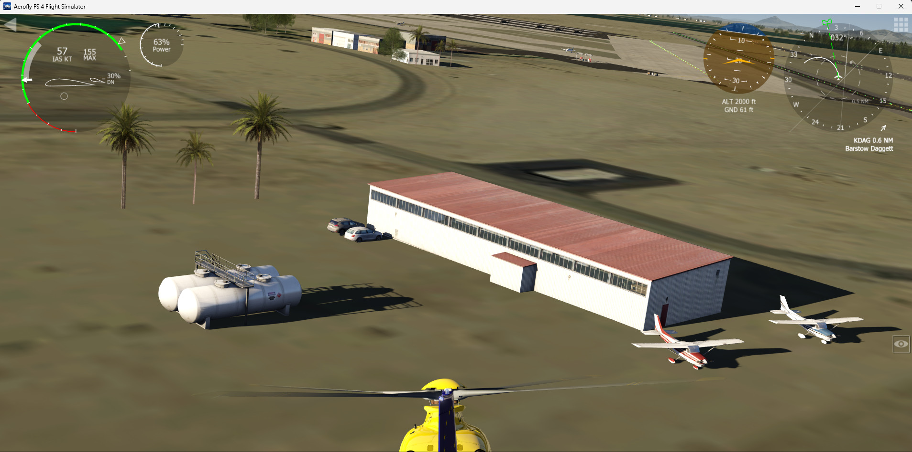

The palms here took −1.5 m, which had a second benefit: it tucked the plant anchor disc out of sight
as well. Section 7 explains that one.

Three things worth taking from this:

- **Fix the site first, the objects second.** Nudging twelve objects to compensate for one wrong site
  figure is work you can skip.
- **Yes, Sim autoheight would have done all of it for you** — and this project can't use it, because
  it has two apron lights. That's the trade-off described above, in a real case rather than in the
  abstract.
- **Flying out to look is part of building a POI, not evidence that you got it wrong.** No elevation
  service and no figure in this guide beats reading it off your own instruments.

The example project ships as it came out of pass one, on purpose. Install it, fly out, and take it
through the other two yourself.

Sim autoheight was designed on the forum by **@chrispriv**, with **@ApfelFlieger**.

---

## 7. Lights and plants

### Lights

Two kinds, both in the **Lights** section:

- **Airport light fixtures** — the sim's own runway edge, threshold, centre line, PAPI, approach,
  taxiway and helipad lights. Pick the fixture, then optionally override its **Colour**, and a
  second colour for the **Opposite** direction ("white one way, red the other"). **Orientation °**
  is a raw rotation, not a compass heading — it matters when you've set an opposite colour.
- **The point light** — fully parametric. Pick a colour, an intensity (0 = off, ~1000 = visible,
  up to 100000 = very bright), and optionally a flash pattern.

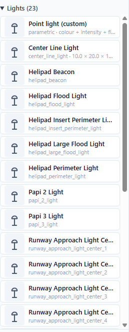

**Lights only render at night.** This is Aerofly's behaviour, not a bug, and it is the single most
common "PCT is broken" report. The **Visibility group** field on each light controls the window:

| Visibility group | On for |
|---|---|
| 0 | night ±40 min |
| 1 | night ±90 min |
| 2 | night ±90 min |
| 3 | **always on (24 h)** |

While you're building in daylight, set group 3 so you can see what you're doing, and drop it back to
0 or 1 when the row is right. Or leave it at 3 on purpose: a light that burns through the afternoon is
wrong for a runway edge and right for a lit-up factory yard.

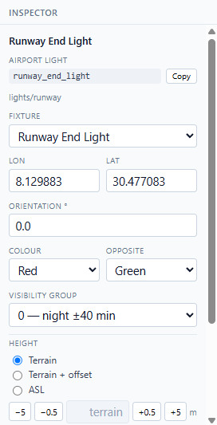

**Flashing** takes four numbers, of which three matter: *Cycle* (bigger = slower), *Sequence*
(the phase), and *Length* (how long each flash lasts). Stagger *Sequence* 1, 2, 3, 4… across a row
of point lights and you get a running-light sweep down the row — worth doing after **Space evenly**
(section 5), since a sweep is only convincing if the gaps it crosses are equal.

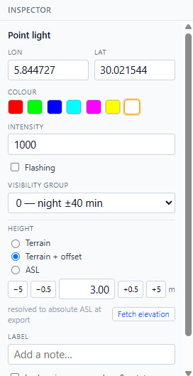

Remember: lights need **Baked ASL**.

### Plants

41 trees and shrubs — broadleaf, conifer, conifer forest, palm, shrub and alley — from 0.8 m of
scrub to a 28 m forest conifer. Pick one, click the map, and set how tall it grows.

Plants are **billboards**: they always turn to face you, so there's no heading to set and no
rotation to get wrong.

**Two different fields are both called "height", and mixing them up is the classic mistake:**

- **Plant height (m)** — how tall the tree grows.
- **Height** (the shared control below it) — where its base sits, same as every other object.

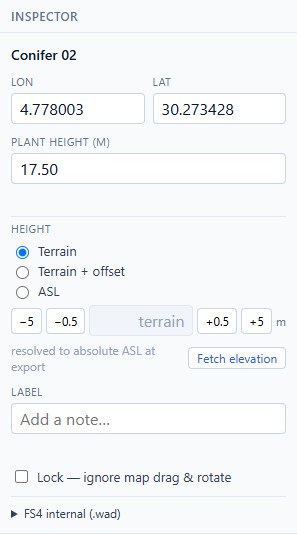

Each plant card shows its natural height — the size the texture was authored at. Straying far from
it makes the tree look stretched or squashed.

**A grey disc lying among your plants?** Because plants are billboards with no mesh of their own,
Aerofly can't size the scenery tile around them, and left alone they blink in and out as you fly. So
any POI containing plants carries one small flat disc of ours, placed at the centre of the plants at
their average height, purely to give the tile something to measure. If the site is baked a little
high — the same half-metre from section 6, surfacing in one more place — that disc ends up lying on
the ground where you can see it.

The fix is one field: give the plants a **larger negative offset** until it goes under the surface
with them. Minus 1.5 m was enough at KDAG. Plants take burial well — you lose the very bottom of the
trunk and nothing else.

---

## 8. Exporting and installing

**Export POI…** opens one dialog that does everything.

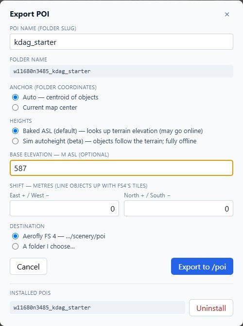

**POI name (folder slug)** — lowercase letters, digits and underscores. This names the folder.

**Folder name** shows you the actual folder PCT will write, live: your slug plus an encoded
coordinate. That coordinate is how Aerofly finds the POI in the world, which is why it's generated
rather than typed.

**Anchor** decides which coordinate gets encoded — *Auto* uses the centroid of everything you've
placed (right almost always), or *Current map center* if you want to pin it deliberately.

**Heights** repeats the Baked ASL / Sim autoheight choice from the top bar. Same setting, shown in
both places so it can't surprise you at the last step.

**Base elevation — m ASL** is the ground figure PCT uses for every object that needs one, instead of
looking it up. Leave it empty and PCT asks an online elevation service; fill it in and that number
wins. It's worth filling in: the service and the sim's terrain mesh disagree by a few metres in
places, and only the sim's number puts your objects on the sim's ground. The worked example in
section 6 is exactly this, measured in flight.

**Shift — metres** nudges the whole scene east/west and north/south. It exists because Aerofly's
terrain tiles don't always agree perfectly with satellite imagery: if everything you built lands
consistently a few metres off in the sim, shift the lot rather than moving every object.

**Destination** — *Install into Aerofly FS 4* writes straight into your `scenery/poi/`. *Export to
a folder…* writes it somewhere you choose, for sharing or for a manual install.

Then: **restart Aerofly FS 4**. The dialog says so for a reason.

**Uninstalling.** The bottom of the dialog lists the POIs currently installed. Anything PCT made
gets an **Uninstall** button. Anything else is listed as "not by PCT" and left alone — PCT will not
delete a folder it didn't create.

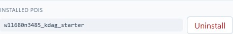

**Sharing.** Export to a folder, zip it, post it. Whoever unzips it into their own
`Aerofly FS 4/scenery/poi/` gets your scene, as long as they own the same objects — which, for
built-in objects, everyone does.

There are two different things you can hand someone, and they're worth keeping straight:

| What you hand over | What it is | What they can do with it |
|---|---|---|
| **The project file** (`.json`) | What **Save** writes: a plain text list of what you placed and where. | Open it in PCT and change it. Needs PCT; installs nothing on its own. |
| **The POI folder** | What **Export** writes: the scenery Aerofly reads. | Drop it into `scenery/poi/` and fly. Needs nothing but the sim. |

Post both and you've given people something to fly *and* something to learn from — which is exactly
what the starter project in section 10 is.

A POI is not the only thing PCT can install. The next section turns the same project into somewhere
you can start a flight.

---

## 9. Heliports — somewhere to fly from

A POI is scenery you fly **to**. It appears in the world and that is all it does: Aerofly's
start-location list never hears about it, so you always begin somewhere else and fly over.

**Install HELIPORT…** writes the same project a second way, as a small airport of your own. It turns
up in Aerofly's **LOCATION** list, and when you choose it you are sitting on the pad you placed, with
everything else in the project around you.

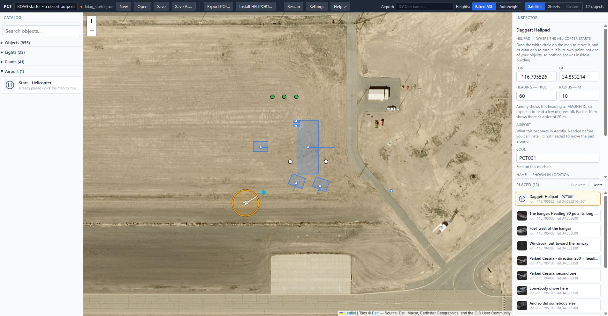

It's the same scene either way — same objects, same headings, same heights. What changes is where it
gets written (`scenery/airports/` rather than `scenery/poi/`) and that it carries the three things
Aerofly needs in order to list a place: a code, a name and a country.

**Install one or the other, not both.** The heliport takes its own copy of everything you placed, so a
project installed as a POI *and* as a heliport puts every object into the world twice.

### 1. Place the pad

Open **Airport** in the catalog, click **Start - Helicopter**, then click the map. It's the same
gesture as placing a tree or a light, and **Esc** cancels it the same way.

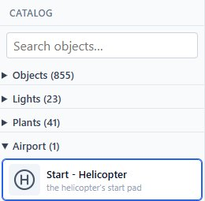

**There is one pad per project.** Click the card again and the next map click *moves* the pad rather
than adding a second one. That's the file format's rule and not a simplification: a heliport has
exactly one master pad — its FATO/TLOF, if you've read the real-world documents.

### 2. It's a point of its own

The pad is drawn as a white circle at its true radius, with a tick showing which way it faces and a
cyan grip to turn it. Drag the circle to move it, drag the grip to turn it, hold **Shift** to snap to
5° — the same gestures an object has, because it is the same control.

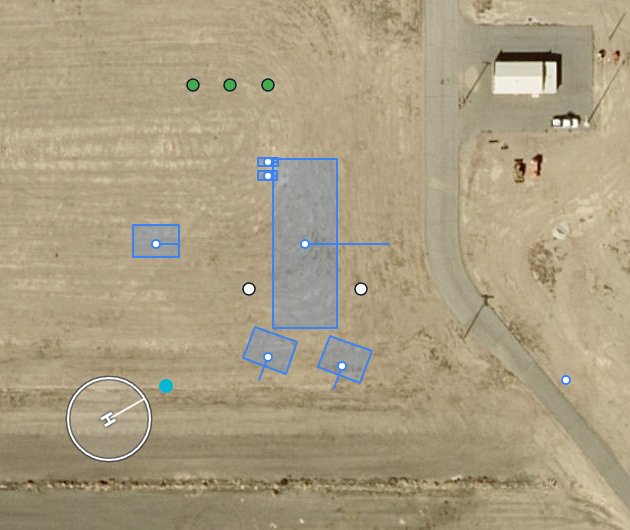

It is **not** one of your objects: it never joins the object count, and it takes no height of its own.
That separation is the reason it exists at all — a start position that was one of the placed objects
would sooner or later spawn the helicopter inside a building.

### 3. Its geometry, in the Inspector

Click the pad on the map, or its row at the top of the placed list, and the whole heliport is in the
Inspector.

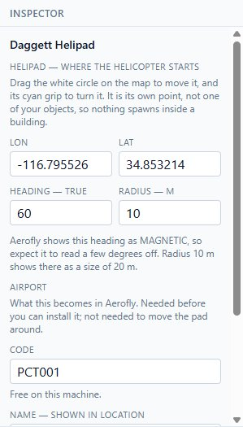

**Lon / Lat** can be typed, and often that is the quicker way round: if you are copying a real
heliport's published coordinates, click roughly on the map to make the pad exist, then paste the
numbers in and watch the circle jump to where it belongs.

**Heading — true** is a true compass heading, like everything else in PCT. Aerofly's own panel reports
a heading as **magnetic**, so expect the sim to show yours a few degrees off. That gap is the local
magnetic variation; nothing has gone wrong.

**Radius — m** is the pad's radius, and it's what the circle on the map is drawn at. Aerofly reports
the **diameter** as the pad's *Size*, so a radius of 10 m turns up in the sim as 20 m.

### 4. Its identity

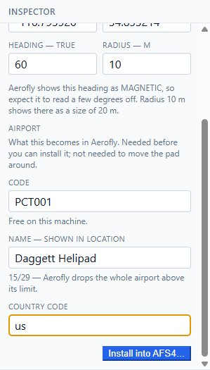

**Code** — four to six letters or digits. This is an airport code, and it has to be one your Aerofly
isn't already using. PCT checks every airport in your install as you type and answers either
**Free on this machine** or a warning. Take the warning seriously: installing over an existing code
does not merge with that airport, it makes it disappear. Invented codes are completely normal here —
`PCT001` is as good as anything.

**Name — shown in LOCATION** is what you will search for inside the sim, so make it something you
would type. **Twenty-nine characters maximum**: above that Aerofly drops the entire airport without
saying so, which is why PCT counts them for you.

**Country code** is two letters — `us`, `de`, `cl`. All it decides is which folder the heliport is
filed under.

None of the three is needed to move the pad around. All three are needed to install it.

### 5. Install it

**Install into AFS4…** at the foot of the Inspector opens the dialog. So does **Install HELIPORT…** in
the top bar, which is the way in when nothing is selected.

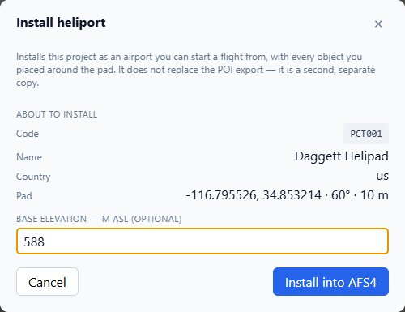

The dialog only writes. Everything under **About to install** is read back from the Inspector rather
than typed here, so there's exactly one place to correct anything. **Base elevation — m ASL** behaves
as it does in the Export dialog: blank asks the elevation service, a number of your own wins over it,
and [section 6](#6-heights--the-one-thing-that-isnt-obvious) is the argument for measuring one. On a
project set to **Sim autoheight** the field disappears, because the pad follows the sim's terrain.

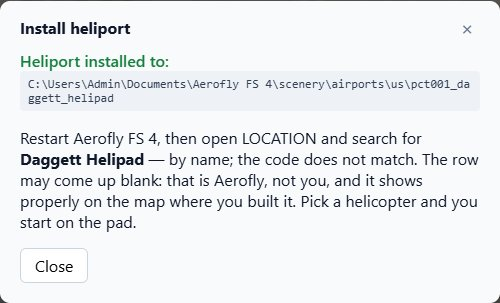

Then **restart Aerofly FS 4**, open **LOCATION**, and **search for the name — not the code.**

Aerofly's location search matches airport *names* only. And the row it hands back can come up
**blank**: the heliport really is there — its distance is right, and the map panel draws it under your
own name and code — but that particular list renders nothing for a code the sim's own database has
never heard of. That one is Aerofly, not you. Pick a helicopter, and you start on the pad.

### Changing it, and taking it out

Change anything, install again, and PCT **replaces** what it wrote — the button reads **Replace in
AFS4** as soon as it recognises the code as one of yours. There's no need to burn a fresh code on
every attempt: build, fly, come back, adjust, install again.

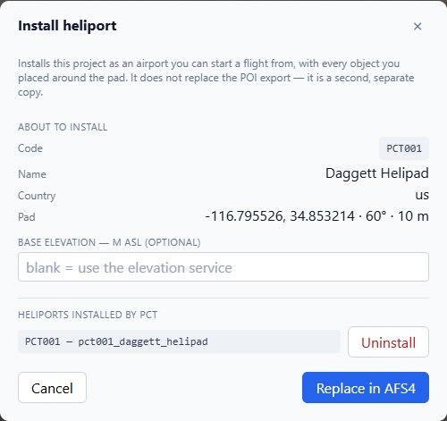

The dialog lists what PCT has installed, with **Uninstall** on each. As with POIs, PCT only lists —
and only removes — folders it made itself, so somebody else's airport can never appear there.

Heliports go into your **Documents** folder rather than the sim's install directory:
`Aerofly FS 4/scenery/airports/<country>/<code>_<name>/`. You can zip that folder and hand it over the
same way you would a POI, as long as its code is not already an airport on the other machine.

### Doing it by hand

The **Export POI…** dialog carries a checkbox, **Heliport template (advanced)**, that drops two extra
text files into the POI folder — `heliport.tsc.txt` and `heliport.wad.txt` — with the same projection
worked out and the identity left blank. They're inert where they land, because they end in `.txt`,
and the steps for turning them into a working heliport are written inside each file. It predates the
button above and it's still there, for anyone who'd rather see and edit what gets written.
[Section 14](#14-where-to-go-next) says where that file format is documented.

---

## 10. Cookbook — seven things worth building

A map and 850 names is a blank canvas, and a blank canvas is the hardest place to start. Here are
seven scenes that take minutes and teach the tool. The first three are all rows, because rows are most
of what anyone builds — and the three of them together are a tour of section 5.

**A row of trees along a road.** Place one plant at each end of the stretch and a handful in between:
the catalog card stays armed, so that's just clicking. Then shift-click the lot and press **Space
evenly**. Don't reach for **Line up** unless the road is genuinely straight — Space evenly keeps each
tree's distance off the line, so a row that follows a bend stays bent and only its gaps get tidied.
Vary the species and the height every few trees or the row reads as a fence. Plants are billboards, so
nothing needs rotating.

**A lit runway where there isn't one.** Plenty of small strips in the sim have no lighting at all.
Place a point light near each end of one edge and four or five roughly along it, shift-click them all,
then **Line up** and **Space evenly** — the row is now as straight and as regular as a real one, at
whatever angle the strip happens to run. To mirror it on the other side, keep the row selected, press
**Ctrl+D**, and walk the copy across with **Shift** + arrow keys, 5 m a press, watching the footprints
against the imagery. White, intensity around 1000. Set visibility group 3 while you're working so you
can see them in daylight, then drop it to 0 and come back at dusk. (Remember: lights need Baked ASL.)

**A line of parked aircraft.** The thing that makes an apron look like an airport rather than a car
park. Drop four or five airliners or light aircraft roughly along the stand, shift-click them, then
**Line up**, **Space evenly**, and **Match row** — that last one turns every one of them to face along
the row, so they park nose-to-tail in one click. If they end up pointing at the wrong end of it, add
180 to the heading, which is one edit for the whole selection. Real stands are hardly ever
north-south, and none of these tools mind what angle yours runs at.

**A working-looking apron.** A hangar, a fuel installation beside it, two or three parked light
aircraft angled toward the taxiway, a couple of cars, and a windsock. Five minutes, and an empty
concrete rectangle turns into a place someone works.

**Your own field.** The airstrip you know, the one that's bare in the sim. This is the scene most
people actually want, and it's the one nobody thinks of first.

**A landmark you can navigate by.** A tall comm mast or a big tower on a ridge, placed where you
always end up looking for one on approach. Set *Terrain*, let PCT find the ground, and you've built
yourself a visual reference.

**Somewhere to start the helicopter.** The hospital roof, the oil platform, the ridge-top clearing,
the pad at the field you fly out of — anywhere Aerofly won't currently let you begin. Drop a
**Start - Helicopter** pad, put a windsock and a hangar beside it so it looks lived-in, give it a
name you'd recognise in a list, and install it as a heliport
([section 9](#9-heliports--somewhere-to-fly-from)). This is the one that changes how you fly rather
than what you fly past.

**A starter project to open and take apart:** `guide/example/kdag_starter.json` in this repository.
It's a small desert outpost beside the runway at Barstow-Daggett — a hangar, a windsock, two parked
Cessnas, a fuel installation, palms and a couple of point lights. Open it in PCT, export it, fly
there, then come back and change things. Learning by modifying something that already works beats
starting from an empty map.

---

## 11. Making the catalog yours — photos and footprints

Two features that cost nothing to skip, and pay off if you use PCT a lot.

### Photos

A catalog card normally shows a drawn icon, sized to the object's real footprint. That icon says
very little: a runway edge light and a taxiway edge light get the same glyph, and Broadleaf 00 and
01 are the same tree a metre apart.

So PCT can show **your own photos** instead — on every card, including lights and plants.

1. Choose where they live: **Settings → Object photos folder**.
2. In the sim, frame the object and take a screenshot **to the clipboard** — `Win+Shift+S` on
   Windows, `Cmd+Ctrl+Shift+4` on macOS.
3. Back in PCT, **right-click that object's card** → **Paste photo from clipboard**.

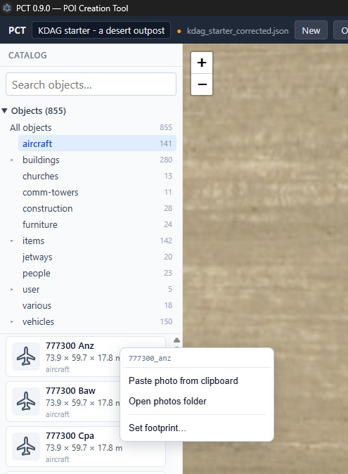

That's it: no filename to type, no id to match. The card knows which object it is — the menu prints
the exact name at the top — so the file is named correctly by construction. **Open photos folder** is
in the same menu, and **Remove photo** joins it once the card has one.

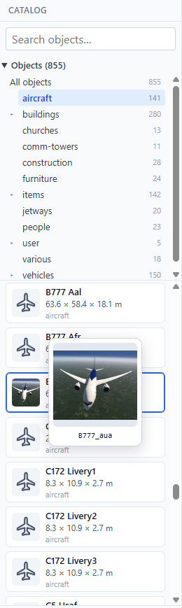

From then on the card carries the photo everywhere it appears, and resting the mouse on it enlarges
the shot — which is the point: two runway light fixtures that share one glyph stop being
interchangeable.

The photos are yours. They're read from your disk, never bundled into PCT, and never written into
your POIs.

You can also fill the folder by hand — name a file after the card's id, in jpg, jpeg, png or webp.
Objects use their bare id (`a380_klm.jpg`); lights and plants are prefixed, because all three share
one folder: `light.runway_edge_light.jpg`, `light.point.jpg`, `plant.palm.08.jpg`. Resting the
mouse on any card tells you the exact name it wants.

### Footprints

An object is drawn on the map as a rectangle at its true size — the sim's own index says how big
each one is. **Lights and plants aren't indexed at all**, so PCT has nothing to draw and they
appear as bare points. A 60-metre approach light bar looks exactly like a single lamp.

If you know the size, tell PCT: **right-click the card → Set footprint…**, type width × depth ×
height in metres, Save. From then on it draws as a real rectangle you can align.

- **Width (X) runs along the facing arrow**, depth (Y) across it. If the box comes out turned 90°,
  swap the two numbers — for a light, PCT has no way to know which way its model was built, so it
  assumes the common case and lets you correct it.
- Height is stored but doesn't change the map: a footprint is a ground outline.
- It works on objects too, if your install's own figure is wrong or missing.
- **Nothing here is exported.** The POI format has no footprint field. This only changes what PCT
  draws while you're placing things.

Your measurements live in your own file, and **rescanning your install never clears them**.
**Settings → Object footprints** has Export and Import, so one person can measure a family of
fixtures once and post the file for everyone else.

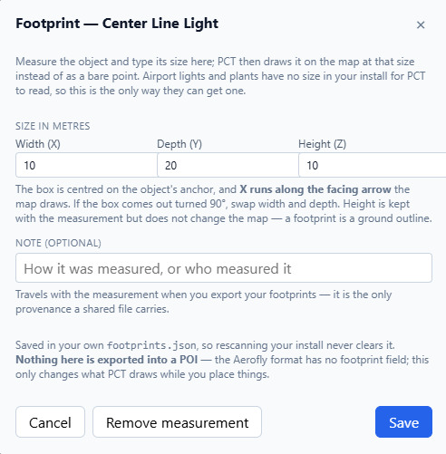

---

## 12. Your own models

Beyond the built-in catalog, PCT can place custom XREF objects you've added to Aerofly yourself —
`.tmb` model files that you, or a scenery add-on, put in your `Aerofly FS 4/scenery/xref/` folder.

A loose `.tmb` won't render on its own: Aerofly needs a small scene-index (`.tmi`) generated for it,
in its own subfolder. PCT does that:

1. **Drop your model** into `…/Aerofly FS 4/scenery/xref/` — the `.tmb` plus its `.ttx` textures.
2. **Rescan** in PCT. Your objects appear with an **unregistered** badge, and a banner offers to
   register them.
3. **Click Register.** PCT reads each model's name and size, generates its `.tmi`, and moves it into
   its own subfolder next to its textures.
4. **Place, rotate, set the height, export** — exactly like a built-in object.

**What's supported:** text-format `.tmb` — what Aerofly's SDK and the AC3D exporter produce — are
read fully. IPACS's pre-compiled binary `.tmb` can't be read automatically and stay greyed out.

As everywhere else, PCT copies no model bytes: it re-lays *your* files and writes the small index
next to them.

---

## 13. When something goes wrong

**I placed things, but the sim shows nothing.**

- **Did you restart Aerofly?** It reads `scenery/poi/` at startup only. This is the answer most of
  the time.
- Are you in the right place? The POI folder name encodes its coordinate; fly to what you placed,
  not to where you think you placed it.
- Check the install actually happened: **Export POI…** → the **Installed POIs** list should show
  your folder.

**I placed a light and see nothing.** Lights only render at night. Set **Visibility group** to
**3 — always on (24 h)** while you're building, or come back at dusk.

**My objects float, or they're buried.** That's the height mode. In **Baked ASL**, PCT bakes an
elevation from an online lookup, and the sim's terrain mesh can differ from it by a few metres.
Either switch the project to **Sim autoheight**, or select the object and use the ± buttons.

**Everything is offset by the same few metres.** Don't move every object — use **Shift — metres**
in the Export dialog to move the whole scene at once.

**An object came out facing the wrong way.** Ignore the heading number and rotate until the
**footprint rectangle** matches the imagery. The rectangle is always true; the heading convention
holds for most models but not every one.

**Export says it can't get the terrain elevation.** No connection, or the service is down. Type a
figure into **Base elevation (m ASL)** and export again, or switch the project to **Sim
autoheight**, which needs no lookup at all.

**Export refuses in autoheight mode.** Autoheight can't place lights (the sim buries them) and
can't use ASL heights. Switch those objects to Terrain, or switch the project to Baked ASL.

**Line up and Space evenly are greyed out.** They need **three or more** objects selected —
shift-click to add to a selection — since two objects are a straight, evenly spaced row already. If
three are selected and the buttons are still dead, they're all sitting on the same spot, and a row of
coincident points has no direction to line up along.

**Arrange moved everything except one object.** That one is **locked**. Locked objects still count
when PCT works out where the row runs, but they never move; clear the lock in the Inspector if you
want it included.

**The catalog says fewer objects than the scan did.** Expected: the scan reports 911, the Objects
list browses about 850. The gap is the flexible-jetway parts, which PCT hides because they only line
up assembled inside an airport's own scenery. Section 4 has the detail.

**I installed a heliport and can't find it in LOCATION.** Restart the sim first — an airport is read
at startup just like a POI. Then search for the **name**, not the code: Aerofly's location search
matches names only. If the row that comes back is blank, that is expected for an invented code and the
heliport is still there — the map panel draws it under your own name and code. Section 9.

**PCT says my airport code is already an airport on this machine.** Then it is, and installing over it
would make that airport disappear, so PCT won't. Pick another code — they're free to invent.

**Install HELIPORT… says the project has no helipad.** Place one first: **Airport → Start -
Helicopter** in the catalog, then click the map.

**The heading the sim shows isn't the one I typed.** PCT's **Heading — true** is true; Aerofly
reports pad headings as magnetic. The difference is the local magnetic variation.

**Everything I built is in the world twice.** The project is installed both as a POI and as a
heliport, and the heliport carries its own copy of every object. Uninstall one of them.

**Something else.** PCT keeps a plain-text log of the session: which folders it used, what the scan
found, and anything that failed. **Settings → Diagnostics → Open log file**. It's rewritten from
scratch every time PCT starts, so it never grows, and nothing in it is sent anywhere. Pasting it
into a forum post saves a round of questions.

---

## 14. Where to go next

**The forum.** PCT was born on the Aerofly forum and most of what's in it came from people there.
Questions, bug reports and scenes you've built are all welcome:
https://www.aerofly.com/community/

**The technical reference.** Building PCT meant working out how Aerofly FS 4 actually stores and
places scenery, much of which IPACS never documented. That's written up separately as a field guide
to **the simulator**, not to this tool: `reference/AFS4_KNOWLEDGE_BASE_EN.md` in this repository.
Fifteen sections — where everything lives in an install, the file grammar, what `tm.log` tells you
before you ever take off, POI vs airport placement, orientation maths, heights, plants, lights,
your own `.tmb` objects, heliports, the UDP flight-data stream, the Blender pipeline. Useful to
anyone building things for AFS4, whether or not they ever touch PCT.

That reference is also where the Inspector's **FS4 internal (.wad)** read-out is explained: the
projected 0–65536 grid and the radians the sim keeps inside its own world-airport database. It is the
same projection PCT works out for you when it installs a heliport (section 9); the read-out exists
because a handful of people build those entries by hand and were converting the coordinates in a
spreadsheet.

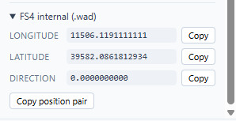

**The source.** PCT is GPL-3.0, Electron + TypeScript:
https://github.com/jlgabriel/afs4-poi-creator

**Credit where it's due.** PCT is a community tool. Michael (@ApfelFlieger) had the idea, supplied
the complete file-format specification and argued for a scope that made a first release realistic.
Frank Boës (@Armitage) let PCT bundle his open airport dataset. Christophe (@chrispriv) and Rodeo
untangled how Aerofly decides an object's height, and Christophe went on to design the
Sim-autoheight mode. The full list is in the project README.

PCT is an independent, unofficial community project — not affiliated with or endorsed by IPACS.
Aerofly FS 4 and all its content belong to IPACS; PCT bundles none of it, and the POIs you create
only reference objects you already own.
