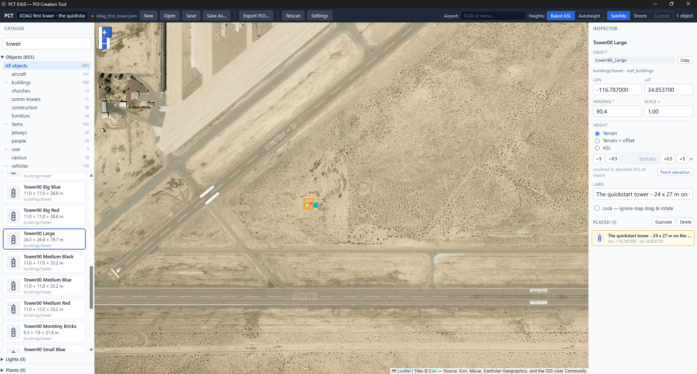
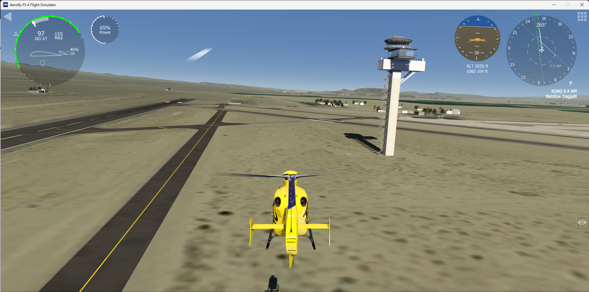
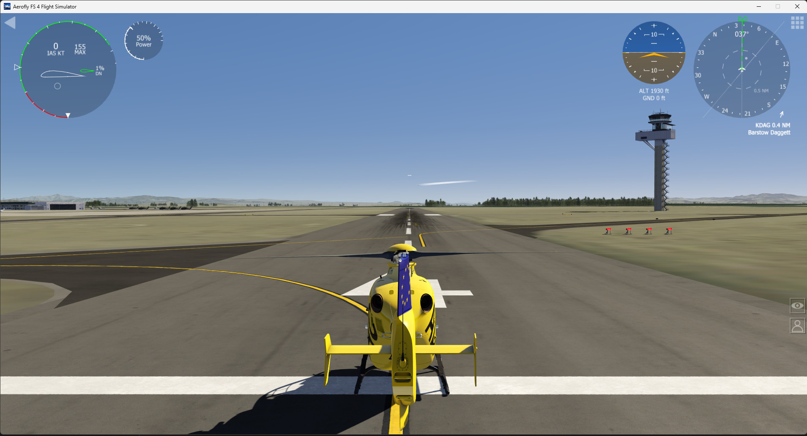

# PCT — the guide

**Decorate your Aerofly FS 4 world with the sim's own built-in objects.** Place them on a real
satellite map, and PCT hands you a scenery folder you drop straight into the sim. No modelling, no
file editing.

This guide is written to be read straight through the first time, and dipped into afterwards. Each
section stands on its own.

1. What PCT actually does
2. Getting PCT running
3. Quickstart — one object, five minutes
4. The editor in one screen
5. Placing, moving, rotating
6. Heights — the one thing that isn't obvious
7. Lights and plants
8. Exporting and installing
9. Cookbook — five things worth building
10. Making the catalog yours — photos and footprints
11. Your own models
12. When something goes wrong
13. Where to go next

---

## 1. What PCT actually does

Aerofly FS 4 already contains hundreds of scenery objects — hangars, control towers, terminals,
fuel tanks, vehicles, parked aircraft, street lamps, trees. They sit in your install, and normally
only IPACS's own scenery uses them.

PCT lets you place those same objects yourself. You click on a satellite map, PCT writes a standard
POI scenery folder, you drop it into Aerofly, and the objects are there next time you fly.

Placed in PCT, on a satellite map. And then the same spot, flown:

That is the whole idea: what you arrange on the map is what you fly through in the sim.

Three things are worth knowing up front:

- **PCT ships no Aerofly content.** It reads the object catalog out of *your* installed copy of the
  sim. You only ever place objects you already own, and the folder PCT writes contains only the
  *names* of the objects you chose — never the objects themselves.
- **The POIs you make are yours.** They're the program's output, not covered by PCT's license.
  Share them, post them, sell them.
- **Nothing is permanent.** PCT installs POI folders and can uninstall the ones it made.

A stock install gives PCT about **911 objects**, **41 plants**, and the sim's **airport light
fixtures** to work with.

---

## 2. Getting PCT running

**Download.** Grab the build for your system from the releases page:
https://github.com/jlgabriel/afs4-poi-creator/releases/latest

Windows installer or portable · macOS `.dmg` (arm64 and Intel) · Linux AppImage.

**First launch needs one extra click.** The builds are unsigned — this is a small open-source
project without a paid signing certificate — so your OS warns you once:

- Windows: SmartScreen says "Windows protected your PC" → More info → Run anyway.
- macOS: right-click the app → Open → Open. Or System Settings → Privacy & Security → Open Anyway.
- macOS on Apple Silicon may instead say "PCT.app is damaged and can't be opened". It isn't — it's
  the same quarantine flag, which on Apple chips can't be cleared from the menus. Drag PCT.app into
  Applications, then run this once in Terminal and open it normally:

      xattr -cr /Applications/PCT.app

**Then point PCT at your sim.** A short wizard runs on first launch. It auto-detects where Aerofly
FS 4 is installed, you confirm or browse to it, and PCT scans your object catalog. That scan is the
whole setup — when it reports how many objects it found, you're done.

If the auto-detect misses (a non-standard Steam library, a moved install), use **Browse…** and pick
the folder that contains the sim's `scenery` directory. You can change it later in **Settings**.

---

## 3. Quickstart — one object, five minutes

The fastest possible route to "it worked". One object, somewhere you can't miss it.

We'll use **Barstow-Daggett (KDAG)** — a quiet airfield in the California desert. Flat, empty,
and nothing around to hide what you place.

1. **Find the airport.** Type `KDAG` into the airport search in the top bar. The map recenters on
   the field. Zoom in until you can see the runway clearly.
2. **Pick an object you cannot possibly miss.** In the Catalog panel, open **Objects** and search
   for `tower00_large`. It's 24 × 27 metres on the ground and **80 metres tall** — a skyscraper,
   in a desert. Click its card once; the card highlights to show placement is armed.
3. **Click the map**, on open ground beside the runway — not on it. The object appears as a
   rectangle drawn at its true size, with a cyan handle showing which way it faces.
4. **Leave the height alone.** The default is *Terrain*, which means "on the ground here". That's
   what you want.
5. **Export it.** Click **Export POI…**. Type a POI name — `kdag_first_tower` — leave *Anchor* on
   *Auto*, leave *Destination* on **Install into Aerofly FS 4**, and click **Install into AFS4**.
6. **Restart Aerofly FS 4** and fly to KDAG.

**A restart is required.** Aerofly reads `scenery/poi/` at startup; it will not pick up a new POI
mid-session. This catches everybody once.

If you don't see it, jump to section 12 — but the overwhelmingly common cause is simply not having
restarted the sim.

To take it out again: **Export POI…** → the **Installed POIs** list at the bottom → **Uninstall**.

---

## 4. The editor in one screen

Four areas, and that's the whole app.

**The top bar** holds the project (name, New / Open / Save / Save As…), **Export POI…**,
**Rescan**, **Settings**, the airport search, the **Heights** mode switch, the map style switch
(Satellite / Streets / Custom), and a running count of what you've placed.

**The Catalog panel**, on the left, is everything you can place, in three collapsible sections:

- **Objects** — the built-in XREF models, with a category tree (hangars, towers, terminals,
  aircraft, vehicles, jetways, churches, furniture, people…) and a search box.
- **Lights** — the sim's airport light fixtures plus a fully parametric point light.
- **Plants** — 41 trees and shrubs.

All three start collapsed, so you can see the three families and their counts at a glance. Each
card shows the object's name, its real footprint in metres, and its category. **Rest the mouse on a
card** for a second and a preview pops up with the object's exact id spelled out.

**The map**, in the middle. Satellite imagery from Esri by default; switch to streets when the
imagery is poor in your area, or plug in your own tile URL in Settings. Every placed object is
drawn as a rectangle **at its true size** — that's what lets you line things up against real
features.

**The Inspector**, on the right, edits whatever is selected: exact coordinates, heading, scale,
height, a free-text label, and a lock. Below it, the placed list is everything in the project.

---

## 5. Placing, moving, rotating

**To place:** click a catalog card to arm it, then click the map. The card stays armed, so you can
drop a row of the same object with repeated clicks. Click the armed card again — or press **Esc** —
to disarm.

**To move:** drag the object on the map. Or select it and use the **arrow keys**: 0.5 m per press,
**Shift** for 5 m. Or type exact coordinates into the Inspector.

**To rotate:** drag the **cyan handle**, holding **Shift** to snap to 5°. Or press **R** to jump
straight to the rotation field and type a number.

**"Heading °" is a real compass heading** — 0 = north, 90 = east, clockwise. PCT applies the
object-facing convention it calibrated inside the sim, so the number means what you'd expect from
flying. It holds for the large majority of objects; if one comes out turned the wrong way, ignore
the number and line its **footprint rectangle** up with the imagery instead — that reads true no
matter how the model was authored.

**Scale ×** resizes the object uniformly. Useful, but a scaled object often looks scaled — treat it
as a nudge, not a modelling tool.

The shortcuts worth memorising:

- **Ctrl+D** — duplicate the selection. This is how you build a row of anything.
- **Ctrl+Z / Ctrl+Shift+Z** — undo / redo.
- **Delete** — remove the selection.
- **Ctrl+S** — save. Works even while you're typing in a field.
- **Esc** — disarm placement.

**Lock** in the Inspector ("ignore map drag & rotate") protects an object you've finished
positioning from a stray click. Set it once a piece is exactly where you want it.

**Label** is a note to yourself. It never reaches the sim.

---

## 6. Heights — the one thing that isn't obvious

Everything else in PCT is a click on a map. Height is the part that repays two minutes of reading.

Aerofly places library objects at an **absolute elevation** — metres above sea level. There is no
"just put it on the ground" in the file format. So PCT has to work out what the ground is.

**Per object**, the Inspector offers three modes:

- **Terrain** — sit on the ground here. *This does not mean 0.* It means "resolve the ground
  elevation under this point".
- **Terrain + offset** — ground plus N metres. For anything on a rooftop, or deliberately floating.
- **ASL** — an absolute number you type.

The ± buttons nudge by 0.5 m and 5 m. Nudging a *Terrain* object quietly promotes it to
*Terrain + offset*, so "lift it half a metre" is one click. **Fetch elevation** looks up the ground
under the selected object and shows it as `terrain ≈ 588.0 m ASL`.

**Per project**, the top bar picks how those modes reach the sim:

- **Baked ASL** (the default) — PCT resolves each object's ground elevation and writes an absolute
  number into the POI. It looks the elevation up online, once, at export.
- **Sim autoheight (beta)** — Aerofly itself grounds each object when it loads the scenery. The
  export is then **fully offline**, and objects follow the terrain even if a sim update re-levels
  it. In this mode *Terrain* means "on the ground", *Terrain + offset* floats N metres above it,
  and *ASL* has no meaning at all.

Autoheight is generally the more reliable of the two, because the sim's own terrain is the final
authority — the elevation service and the sim's mesh disagree by a few metres in places (at KDAG:
584 m from the service, 588 m in the sim). It's marked beta because it leans on undocumented sim
behaviour that could change with a sim update.

**Two limits of autoheight**, both enforced before export so you find out here rather than in the
air:

- **It can't place lights.** The sim buries them below the terrain. Lights need Baked ASL.
- **It can't use ASL heights**, since there's no absolute reference to hang them on.

**No internet at export time?** Use Baked ASL and type a figure into **Base elevation (m ASL)** in
the Export dialog. Every object that needs a ground height uses that one number — fine for a flat
site, wrong for a hillside. (KDAG is 588 m.)

Sim autoheight was designed on the forum by **@chrispriv**, with **@ApfelFlieger**.

---

## 7. Lights and plants

### Lights

Two kinds, both in the **Lights** section:

- **Airport light fixtures** — the sim's own runway edge, threshold, centre line, PAPI, approach,
  taxiway and helipad lights. Pick the fixture, then optionally override its **Colour**, and a
  second colour for the **Opposite** direction ("white one way, red the other"). **Orientation °**
  is a raw rotation, not a compass heading — it matters when you've set an opposite colour.
- **The point light** — fully parametric. Pick a colour, an intensity (0 = off, ~1000 = visible,
  up to 100000 = very bright), and optionally a flash pattern.

**Lights only render at night.** This is Aerofly's behaviour, not a bug, and it is the single most
common "PCT is broken" report. The **Visibility group** field controls the window: group 0 is
night ±40 minutes, groups 1 and 2 are night ±90 minutes, and **group 3 is always on, 24 hours**.
If you want to see a light at noon while you're building, use group 3.

**Flashing** takes four numbers, of which three matter: *Cycle* (bigger = slower), *Sequence*
(the phase), and *Length* (how long each flash lasts). Stagger *Sequence* 1, 2, 3, 4… across a row
of point lights and you get a running-light sweep down the row.

Remember: lights need **Baked ASL**.

### Plants

41 trees and shrubs — broadleaf, conifer, conifer forest, palm, shrub and alley — from 0.8 m of
scrub to a 28 m forest conifer. Pick one, click the map, and set how tall it grows.

Plants are **billboards**: they always turn to face you, so there's no heading to set and no
rotation to get wrong.

**Two different fields are both called "height", and mixing them up is the classic mistake:**

- **Plant height (m)** — how tall the tree grows.
- **Height** (the shared control below it) — where its base sits, same as every other object.

Each plant card shows its natural height — the size the texture was authored at. Straying far from
it makes the tree look stretched or squashed.

---

## 8. Exporting and installing

**Export POI…** opens one dialog that does everything.

**POI name (folder slug)** — lowercase letters, digits and underscores. This names the folder.

**Folder name** shows you the actual folder PCT will write, live: your slug plus an encoded
coordinate. That coordinate is how Aerofly finds the POI in the world, which is why it's generated
rather than typed.

**Anchor** decides which coordinate gets encoded — *Auto* uses the centroid of everything you've
placed (right almost always), or *Current map center* if you want to pin it deliberately.

**Heights** repeats the Baked ASL / Sim autoheight choice from the top bar. Same setting, shown in
both places so it can't surprise you at the last step.

**Shift — metres** nudges the whole scene east/west and north/south. It exists because Aerofly's
terrain tiles don't always agree perfectly with satellite imagery: if everything you built lands
consistently a few metres off in the sim, shift the lot rather than moving every object.

**Destination** — *Install into Aerofly FS 4* writes straight into your `scenery/poi/`. *Export to
a folder…* writes it somewhere you choose, for sharing or for a manual install.

Then: **restart Aerofly FS 4**. The dialog says so for a reason.

**Uninstalling.** The bottom of the dialog lists the POIs currently installed. Anything PCT made
gets an **Uninstall** button. Anything else is listed as "not by PCT" and left alone — PCT will not
delete a folder it didn't create.

**Sharing.** Export to a folder, zip it, post it. Whoever unzips it into their own
`Aerofly FS 4/scenery/poi/` gets your scene, as long as they own the same objects — which, for
built-in objects, everyone does.

---

## 9. Cookbook — five things worth building

The map and 911 names is a blank canvas, and a blank canvas is the hardest place to start. Here are
five scenes that take minutes and teach the tool.

**A row of trees along a road.** Place one plant beside the road. **Ctrl+D** to duplicate, arrow
keys to walk it along, repeat. Vary the species and the height every few trees or the row reads as
a fence. Plants are billboards, so nothing needs rotating.

**A lit runway where there isn't one.** Plenty of small strips in the sim have no lighting at all.
Place a point light at one corner of the strip, **Ctrl+D**, nudge it down the edge, repeat — then
mirror the row on the other side. White, intensity around 1000, visibility group 0. Come back at
dusk. (Remember: Baked ASL.)

**A working-looking apron.** A hangar, a fuel installation beside it, two or three parked light
aircraft angled toward the taxiway, a couple of cars, and a windsock. Five minutes, and an empty
concrete rectangle turns into a place someone works.

**Your own field.** The airstrip you know, the one that's bare in the sim. This is the scene most
people actually want, and it's the one nobody thinks of first.

**A landmark you can navigate by.** A tall comm mast or a big tower on a ridge, placed where you
always end up looking for one on approach. Set *Terrain*, let PCT find the ground, and you've built
yourself a visual reference.

**A starter project to open and take apart:** `guide/example/kdag_starter.json` in this repository.
It's a small desert outpost beside the runway at Barstow-Daggett — a hangar, a windsock, two parked
Cessnas, a fuel installation, palms and a couple of point lights. Open it in PCT, export it, fly
there, then come back and change things. Learning by modifying something that already works beats
starting from an empty map.

---

## 10. Making the catalog yours — photos and footprints

Two features that cost nothing to skip, and pay off if you use PCT a lot.

### Photos

A catalog card normally shows a drawn icon, sized to the object's real footprint. That icon says
very little: a runway edge light and a taxiway edge light get the same glyph, and Broadleaf 00 and
01 are the same tree a metre apart.

So PCT can show **your own photos** instead — on every card, including lights and plants.

1. Choose where they live: **Settings → Object photos folder**.
2. In the sim, frame the object and take a screenshot **to the clipboard** — `Win+Shift+S` on
   Windows, `Cmd+Ctrl+Shift+4` on macOS.
3. Back in PCT, **right-click that object's card** → **Paste photo from clipboard**.

That's it: no filename to type, no id to match. The card knows which object it is, so the file is
named correctly by construction. The same menu has **Remove photo** and **Open photos folder**.

The photos are yours. They're read from your disk, never bundled into PCT, and never written into
your POIs.

You can also fill the folder by hand — name a file after the card's id, in jpg, jpeg, png or webp.
Objects use their bare id (`a380_klm.jpg`); lights and plants are prefixed, because all three share
one folder: `light.runway_edge_light.jpg`, `light.point.jpg`, `plant.palm.08.jpg`. Resting the
mouse on any card tells you the exact name it wants.

### Footprints

An object is drawn on the map as a rectangle at its true size — the sim's own index says how big
each one is. **Lights and plants aren't indexed at all**, so PCT has nothing to draw and they
appear as bare points. A 60-metre approach light bar looks exactly like a single lamp.

If you know the size, tell PCT: **right-click the card → Set footprint…**, type width × depth ×
height in metres, Save. From then on it draws as a real rectangle you can align.

- **Width (X) runs along the facing arrow**, depth (Y) across it. If the box comes out turned 90°,
  swap the two numbers — for a light, PCT has no way to know which way its model was built, so it
  assumes the common case and lets you correct it.
- Height is stored but doesn't change the map: a footprint is a ground outline.
- It works on objects too, if your install's own figure is wrong or missing.
- **Nothing here is exported.** The POI format has no footprint field. This only changes what PCT
  draws while you're placing things.

Your measurements live in your own file, and **rescanning your install never clears them**.
**Settings → Object footprints** has Export and Import, so one person can measure a family of
fixtures once and post the file for everyone else.

---

## 11. Your own models

Beyond the built-in catalog, PCT can place custom XREF objects you've added to Aerofly yourself —
`.tmb` model files that you, or a scenery add-on, put in your `Aerofly FS 4/scenery/xref/` folder.

A loose `.tmb` won't render on its own: Aerofly needs a small scene-index (`.tmi`) generated for it,
in its own subfolder. PCT does that:

1. **Drop your model** into `…/Aerofly FS 4/scenery/xref/` — the `.tmb` plus its `.ttx` textures.
2. **Rescan** in PCT. Your objects appear with an **unregistered** badge, and a banner offers to
   register them.
3. **Click Register.** PCT reads each model's name and size, generates its `.tmi`, and moves it into
   its own subfolder next to its textures.
4. **Place, rotate, set the height, export** — exactly like a built-in object.

**What's supported:** text-format `.tmb` — what Aerofly's SDK and the AC3D exporter produce — are
read fully. IPACS's pre-compiled binary `.tmb` can't be read automatically and stay greyed out.

As everywhere else, PCT copies no model bytes: it re-lays *your* files and writes the small index
next to them.

---

## 12. When something goes wrong

**I placed things, but the sim shows nothing.**

- **Did you restart Aerofly?** It reads `scenery/poi/` at startup only. This is the answer most of
  the time.
- Are you in the right place? The POI folder name encodes its coordinate; fly to what you placed,
  not to where you think you placed it.
- Check the install actually happened: **Export POI…** → the **Installed POIs** list should show
  your folder.

**I placed a light and see nothing.** Lights only render at night. Set **Visibility group** to
**3 — always on (24 h)** while you're building, or come back at dusk.

**My objects float, or they're buried.** That's the height mode. In **Baked ASL**, PCT bakes an
elevation from an online lookup, and the sim's terrain mesh can differ from it by a few metres.
Either switch the project to **Sim autoheight**, or select the object and use the ± buttons.

**Everything is offset by the same few metres.** Don't move every object — use **Shift — metres**
in the Export dialog to move the whole scene at once.

**An object came out facing the wrong way.** Ignore the heading number and rotate until the
**footprint rectangle** matches the imagery. The rectangle is always true; the heading convention
holds for most models but not every one.

**Export says it can't get the terrain elevation.** No connection, or the service is down. Type a
figure into **Base elevation (m ASL)** and export again, or switch the project to **Sim
autoheight**, which needs no lookup at all.

**Export refuses in autoheight mode.** Autoheight can't place lights (the sim buries them) and
can't use ASL heights. Switch those objects to Terrain, or switch the project to Baked ASL.

**Something else.** PCT keeps a plain-text log of the session: which folders it used, what the scan
found, and anything that failed. **Settings → Diagnostics → Open log file**. It's rewritten from
scratch every time PCT starts, so it never grows, and nothing in it is sent anywhere. Pasting it
into a forum post saves a round of questions.

---

## 13. Where to go next

**The forum.** PCT was born on the Aerofly forum and most of what's in it came from people there.
Questions, bug reports and scenes you've built are all welcome:
https://www.aerofly.com/community/

**The technical reference.** Building PCT meant working out how Aerofly FS 4 actually stores and
places scenery, much of which IPACS never documented. That's written up separately as a field guide
to **the simulator**, not to this tool: `reference/AFS4_KNOWLEDGE_BASE_EN.md` in this repository.
Fifteen sections — where everything lives in an install, the file grammar, what `tm.log` tells you
before you ever take off, POI vs airport placement, orientation maths, heights, plants, lights,
your own `.tmb` objects, heliports, the UDP flight-data stream, the Blender pipeline. Useful to
anyone building things for AFS4, whether or not they ever touch PCT.

**The source.** PCT is GPL-3.0, Electron + TypeScript:
https://github.com/jlgabriel/afs4-poi-creator

**Credit where it's due.** PCT is a community tool. Michael (@ApfelFlieger) had the idea, supplied
the complete file-format specification and argued for a scope that made a first release realistic.
Frank Boës (@Armitage) let PCT bundle his open airport dataset. Christophe (@chrispriv) and Rodeo
untangled how Aerofly decides an object's height, and Christophe went on to design the
Sim-autoheight mode. The full list is in the project README.

PCT is an independent, unofficial community project — not affiliated with or endorsed by IPACS.
Aerofly FS 4 and all its content belong to IPACS; PCT bundles none of it, and the POIs you create
only reference objects you already own.
